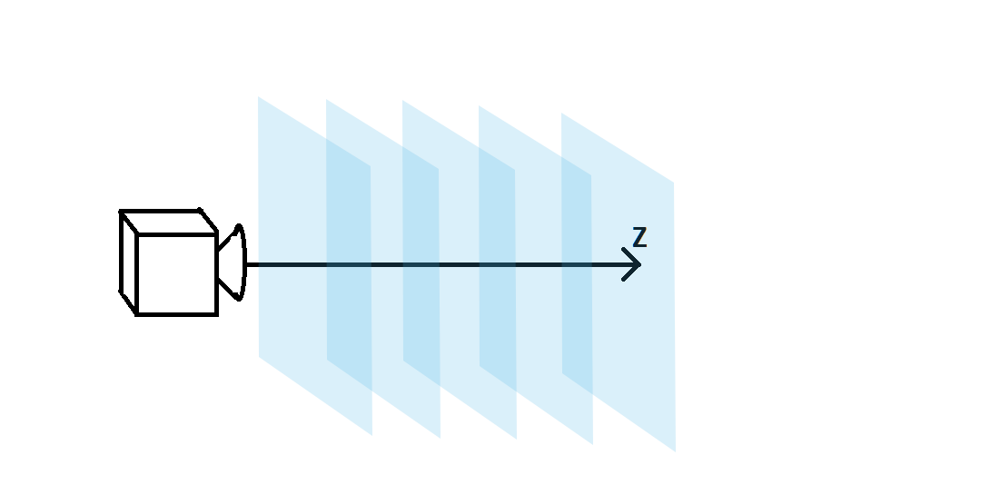
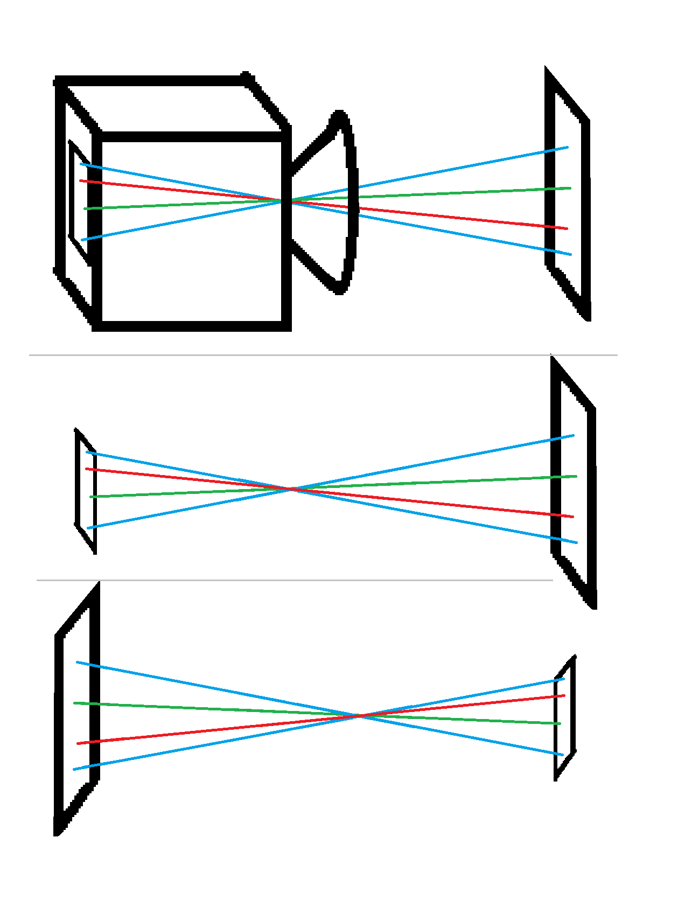

# the theory of perspective in photos of plane geometry

## summery

the photos I took of the plastic frame and the soapy film, were deformed by perspective affects, which morph the shape of the two strings in each picture.
in this page I explain how I undo these perspective affects, and map points in the image back to points in real, undistorted, space.

let it also be noted that the soap fil, the plastic frame, and the string all reside within the same plane in space.

for the sake of this explanation I work with three coordinate systems:

1. u,v - the real world coordinate system, that is confined to the plane of the soap film, plastic frame, and string.
2. x,y,z - the real world space coordinates system. z is taken to be perpendicular to the camera lens, and x is horizontal.
3. x',y' - the coordinates in the picture (same as the coordinates at the cameras film).

in short, I calibration 6 arguments of the transformation from real space to image space, via optimization functions, and, fix the perspective affects, and get the real world coordinates of these points via applying the reverse transformation on the image coordinate points.

## transforming u,v to x',y'

### u,v to x,y,z

transforming u,v to x,y,z, is preformed by taking the following linear algebra definition of a plane:

$$
\text{plane S} = \{\vec{a}*u + \vec{b}*v + \vec{c_0} \text{ | for all u,v in } \mathbb{R} \} \\
\text{ where } \vec{a} , \vec{b}, \vec{c_0} \text{ are all some 3d vectors that define the plane.}
$$
and also allow us to choose a,b so that they are orthonormal and oriented so that $\vec{a}$ has no y component, $\vec{b}$ has no x component, and that $\vec{c_0}$ is parallel to the z direction. also orthonormal also means that $\|\vec{a}\|=\|\vec{b}\|=1$.  
in our case, we eventually use this transform to fit image points to real world points, so altho we can't make this assumption, we do eventually need to supply a rotation degree of freedom in the final matching of the transformed points to the target points. this means we can apply a rotation in u,v so that the assumption above, about $\vec{a}$, $\vec{b}$ is met. also, because we eventually fit real points to image points, we also need to supply a translation degree of freedom, the translation needs to be in u,v (before or after the rotation). we shall denote the rotation angle with $\alpha$, if no rotation is necessary, you can choose $\alpha = 0$. also the translation shall denoted with $\vec{t}$. to avoid confusion, we shall denote u',v', the coordinates in the u,v plane after the rotation and translation.  
now, applying the following logic we can get this transformation in affine matrix form:

$$
\text{let }\vec{x}\text{ be a point in S:}\\
\vec{x} = \vec{a}*u' + \vec{b}*v' + \vec{c_0} \\
\vec{x} = \underbrace{\begin{pmatrix}
a_1 & b_1 & (c_0)_1 \\
a_2 & b_2 & (c_0)_2 \\
a_3 & b_3 & (c_0)_3 \\
\end{pmatrix}}_{\coloneqq \text{ Q}}
\begin{pmatrix}u' \\v' \\1 \\\end{pmatrix} \\
\vec{x} = \underbrace{
\begin{pmatrix}
a_1 & b_1 & (c_0)_1 \\
a_2 & b_2 & (c_0)_2 \\
a_3 & b_3 & (c_0)_3 \\
\end{pmatrix}
\underbrace{\begin{pmatrix}
1 & 0 & t_1 \\
0 & 1 & t_2 \\
0 & 0 & 1 \\
\end{pmatrix}}_{\text{translation in u,v}}
\underbrace{\begin{pmatrix}
cos(\alpha) & -sin(\alpha) & 0 \\
sin(\alpha) & cos(\alpha)  & 0 \\
0           & 0            & 0 \\
\end{pmatrix}}_{\text{rotation in u,v}}
}_{\coloneqq \text{ P}}
\begin{pmatrix}u \\v \\1 \\\end{pmatrix} \\
\vec{x} = P\begin{pmatrix}u \\v \\1 \\\end{pmatrix}
$$

now, we know a lot of cells are zero: $a_2 = b_1 = (c_0)_1 = (c_0)_2 = 0$. and since we know $\vec{a}$ and $\vec{b}$ are normalized: $\|\vec{a}\|=\|\vec{b}\|=1$, and we can thus choose to select $a_1=cos(\theta)$, $b_2=cos(\phi)$ and we get:

$$
Q =
\begin{pmatrix}
cos(\theta) & 0         & 0       \\
0           & cos(\phi) & 0       \\
sin(\theta) & sin(\phi) & z_0     \\
\end{pmatrix}
$$

$\theta$ and $\phi$ are the angles the planes normal makes with the z axis.

and, to sum up, we get:
$$
\begin{pmatrix}x \\y \\z \\\end{pmatrix} = P\begin{pmatrix}u \\v \\1 \\\end{pmatrix} \\
P = \begin{pmatrix}
cos(\theta) & 0         & 0       \\
0           & cos(\phi) & 0       \\
sin(\theta) & sin(\phi) & z_0     \\
\end{pmatrix}
\cdot
\begin{pmatrix}
1 & 0 & t_1 \\
0 & 1 & t_2 \\
0 & 0 & 1 \\
\end{pmatrix}
\cdot
\begin{pmatrix}
cos(\alpha) & -sin(\alpha) & 0 \\
sin(\alpha) & cos(\alpha)  & 0 \\
0           & 0            & 0 \\
\end{pmatrix}
$$

### x,y,z to x',y'

perspective affects can be explained, simply put, by dividing the space in front of the camera into many (a continuum of) parallel planes all perpendicular to the z direction. each of these planes on it's own acquires no distortion from the perspective affects. the perspective affect is that planes that are further away are scaled down more. or in other words things that are on further planes appear smaller. note that I didn't write that further things appear smaller, since you could have some thing be really far away in x,y, but still be relatively close in z, and for perspective affects, z is what counts. the reason for this is related to optics and is not relevant enough to be discussed here

||
|:--:|
||
|illustration of the space in front of the camera being divided up into many parallel planes all perpendicular to the z direction|

so in mathematical language, since the angular size of observed objects goes like $angular\ size \propto \frac{size of object}{distance z}$, so in order to model the transformation from x,y,z to x',y', we simply need to apply the following:

$$
\begin{pmatrix}x'\\y'\end{pmatrix} = \eta \begin{pmatrix}\frac{x}{z}\\\frac{y}{z}\end{pmatrix}
$$

where eta is some constant the holds all sort of scaling factors.

### to sum up, u,v to x',y':

$$
P = \begin{pmatrix}
cos(\theta) & 0         & 0       \\
0           & cos(\phi) & 0       \\
sin(\theta) & sin(\phi) & z_0     \\
\end{pmatrix}
\cdot
\begin{pmatrix}
1 & 0 & t_1 \\
0 & 1 & t_2 \\
0 & 0 & 1 \\
\end{pmatrix}
\cdot
\begin{pmatrix}
cos(\alpha) & -sin(\alpha) & 0 \\
sin(\alpha) & cos(\alpha)  & 0 \\
0           & 0            & 0 \\
\end{pmatrix}\\
\begin{pmatrix}x \\y \\z \\\end{pmatrix} = P\begin{pmatrix}u \\v \\1 \\\end{pmatrix} \\
\begin{pmatrix}x'\\y'\end{pmatrix} = \eta \begin{pmatrix}\frac{x}{z}\\\frac{y}{z}\end{pmatrix}
$$

as you can see, this transformation has 7 degrees of freedom including $z_0$. but in my use, $z_0$ was not counted, because it is almost degenerate with the scale scalar $\eta$, in my case, I measured $z_0$ to be around 40cm, and used this number in the transformations. so when I optimized a fit for the transform_arguments, I had 6 degrees of freedom, and 4 points in the fit, which totaled up to 8 equations with 6 variables.

## transforming x',y' back to u,v

the mathematical theory described above, of a the process of image taking of points on a plane, with a camera, includes the transformation of the points on the plane, into angles. those angles intersect the photosensitive film inside the camera, which is in itself a plane. every point in the photosensitive film, registers the color value of the ray that intersects with it, and thus the final image is created. the thing is, that from a mathematical standpoint, the transformation here from plane to angles to film, and the reverse transformation from film to angles to plane, are of the same family. of course the parameters are different, but since in [transforming u,v to x',y'](#transforming-uv-to-xy) we found all possible transformations in this family, we know that the reverse transformation must be of the same form. the question is what is the duality connection between the parameters of the u,v to x',y' transform to the parameters of the x',y' to the u,v transform.  

||
|:--:|
||
|ilistration of the duality between the transformation from a plane to the cameras film and the transformation from a cameras film to a plane|

with some algebra you can find the the link is:
$$
\text{if Q in the transformation matrix is}\\
Q = 
\begin{pmatrix}
cos(\theta) & 0         & 0       \\
0           & cos(\phi) & 0       \\
sin(\theta) & sin(\phi) & z_0     \\
\end{pmatrix} \\
\text{than }\tilde{Q}\text{ of the reverse transformation matrix is}\\
\tilde{Q} = 
\begin{pmatrix}
\frac{z_0}{cos(\theta)} & 0                     & 0       \\
0                       & \frac{z_0}{cos(\phi)} & 0       \\
-tan(\theta)            & -tan(\phi)            & 1       \\
\end{pmatrix} \\
$$

and of course if $R$ is the rotation of the original transformation, $\tilde{R}$ the rotation of the reverse transformation, $T$ is the translation of the original transformation, and $\tilde{T}$ the translation of the reverse transformation:
$$
R = \begin{pmatrix}
cos(\alpha) & -sin(\alpha) & 0 \\
sin(\alpha) & cos(\alpha)  & 0 \\
0           & 0            & 0 \\
\end{pmatrix}\\
T = \begin{pmatrix}
1 & 0 & t_2 \\
0 & 1 & t_1 \\
0 & 0 & 1   \\
\end{pmatrix}\\
\tilde{R} = \begin{pmatrix}
cos(-\alpha) & -sin(-\alpha) & 0 \\
sin(-\alpha) & cos(-\alpha)  & 0 \\
0           & 0            & 0 \\
\end{pmatrix}\\
\tilde{T} = \begin{pmatrix}
1 & 0 & -t_2 \\
0 & 1 & -t_1 \\
0 & 0 & 1   \\
\end{pmatrix}\\
$$

and from here it's only slightly different from how it's detailed in [transforming u,v to x',y'](#transforming-uv-to-xy).

$$
\begin{pmatrix}x \\y \\z \\\end{pmatrix} = \tilde{Q}\begin{pmatrix}x'\eta^-1 \\y'\eta^-1 \\1 \\\end{pmatrix} \\
\begin{pmatrix}u\\v\\1\end{pmatrix} = \tilde{R}\tilde{T}\begin{pmatrix}\frac{x}{z}\\\frac{y}{z}\\1\end{pmatrix}\\
$$

the difference from [transforming u,v to x',y'](#transforming-uv-to-xy) arises because of the scaling, translation and rotation, all of which are not part of the duality which was previously explained.
