line detector v3 works via fitting a line pattern around every pixel. in the first attempt I use two patterns, x oriented and y oriented, the results are:  
  
||
|:---:|
||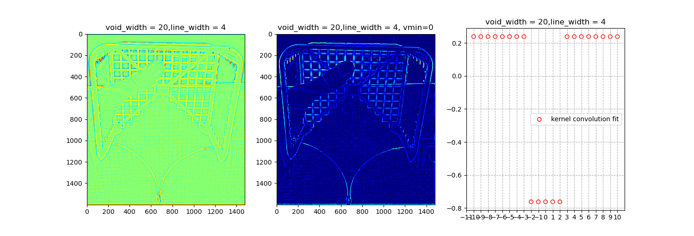|
||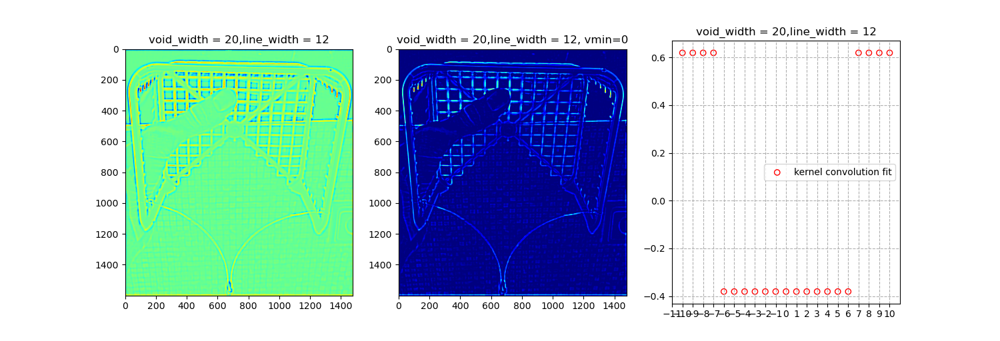|
|||

# v3.1

because I sum the real and imaginary parts, a line's end point gets double, which is bad, so in v3.1 I add take the maximum of the real and the imaginary, instead of the sum:

|||
|:---:|:---:|
||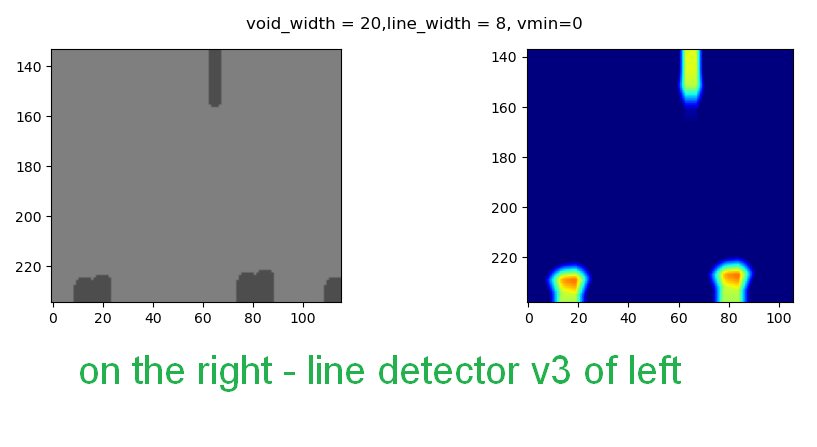|

||
|:---:|
|table of results of line detector v3.1 when applied to a test pattern|

||line width = 1|line width = 4|line width = 7|line width = 10|line width = 13|
|:---|:---:|:---:|:---:|:---:|:---:|
|void width = 10|||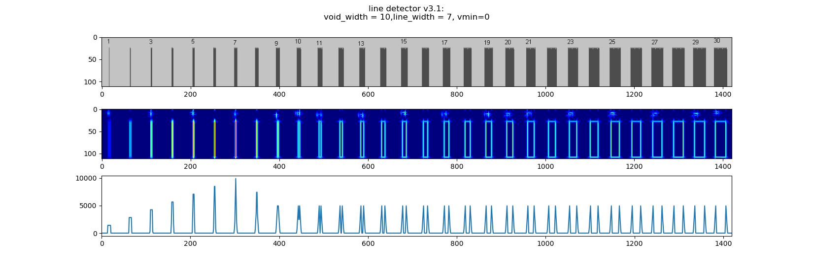|
|void width = 20|||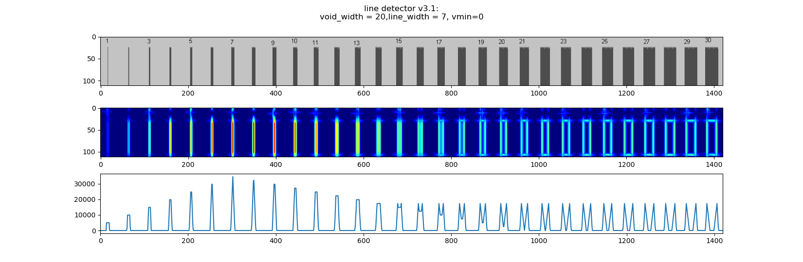||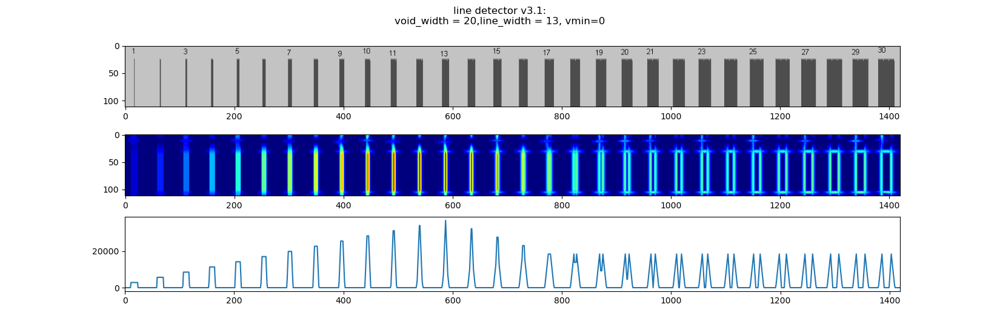|
|void width = 30|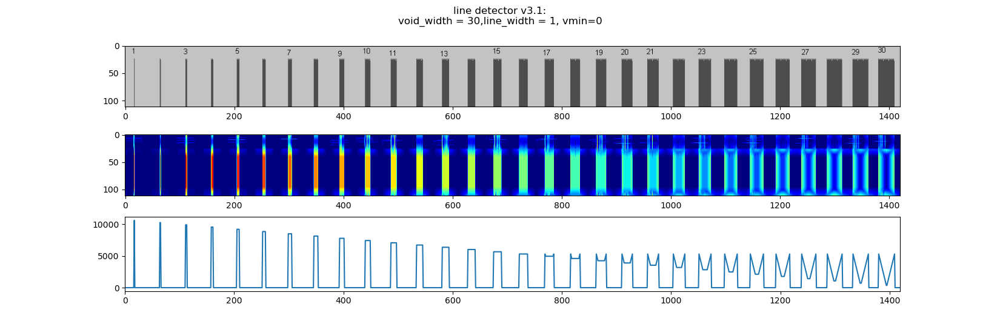||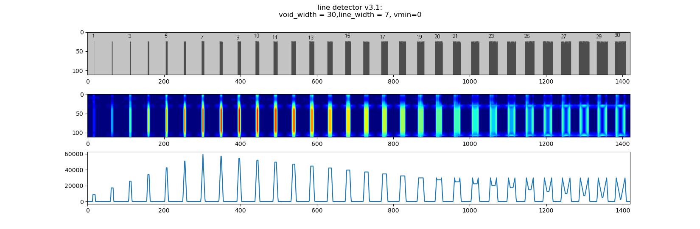|||

it can be seen that the performance is optimal when void width = (line width+1)*2.
now, I want to compose some smooth function that will inherently hold this relation
[void width = (line width+1)*2], and thus have only one major parameter.

# v3.2

i ended up making line-detector v3.2 which uses the second derivative of a Gaussian filter,
this is faster due to me using an elementary function called scipy.ndimage.gaussian_filter.
**but this ended up lowering the performance, so Obviously I wont be using it.**  

||version 3.1|version 3.2|
|:---|:---:|:---:|
|line width = 1|||
|line width = 2|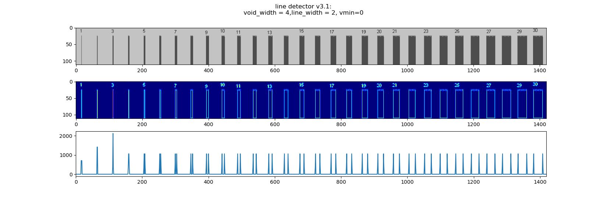||
|line width = 3|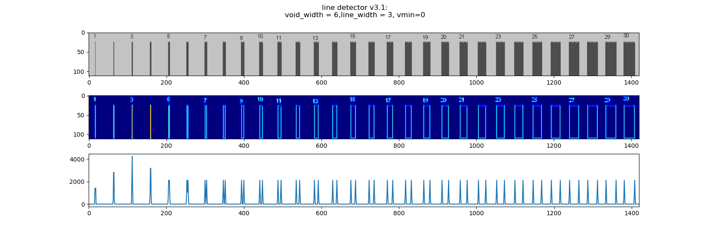||
|line width = 4|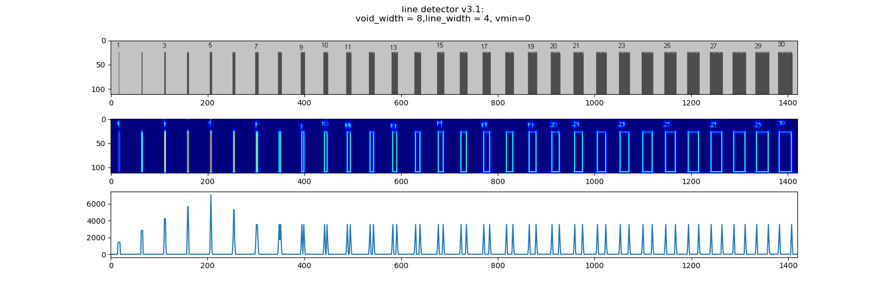||
|line width = 5||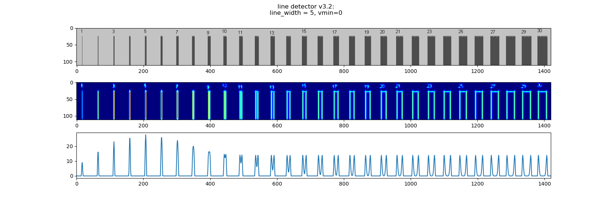|
|line width = 6|||
|line width = 7|||

# v3.3

v3.3 is based on v3.1 except I stop using complex numbers, and added diagonals.


|||
|:-:|:-:|
|||

the following problem arose, the diagonal kernels slightly negatively detect diagonal lines that are orthogonal to them.
this is because the parpandicular diagonals sum up to not 1, as the following figure shows

the solution is to normalise, in such a way that all perpandicular diagonals sum up to zero.

# v3.4


this apparently fixed the problem, but has reduced line detection performance.
this is not surprising as we found that sharp edges only improve performance.
a possible solution is use the rotation functions automatic ability to black
out the corners, and resize the image.

# v3.5


notice the diagonal kernels are bigger.
I will note that the diagonal kernels are normalized, so they add up to zero,
this was slightly tricky to do:

```python
# normalise diag1_kernel
rot_mask = rotate(x_ker*0+1,-45,reshape=True,order=1)
diag1_ker -= np.sum(diag1_ker)/np.sum(rot_mask)
diag1_ker *= rot_mask
```

the resulting line detection is:


this is definitely a great improvement

# v3.6

small change to how the different colors sum up, used to sum the square of the
detection score for each color, in v3.6 I remove the square.

```python
### v3.5 ###
fit_value_magnitude = np.sum(fit_value**2,-1)
return fit_value_magnitude
### v3.6 ###
fit_value_magnitude = np.sum(fit_value,-1)
return fit_value_magnitude
```


after this change we get a more even result for some reason,
or an other way to say this is that somewhat unsurprisingly squaring the line
detector result for each color before adding them up makes the resulting scores-image
uneven, less predictable, and frankly worse:

comparison of images :

||
|:---:|
|$ColorScore\_v1(M)竏有ocationScore\_v2(M)竏有ineDetectorScore\_v3.5(M)$|
  
||
|:---:|
|*$ColorScore\_v1(M)竏有ocationScore\_v2(M)竏有ineDetectorScore\_v3.6(M)$*|

# v3.7

made this after making v4.1, only difference is that I add the std and orginatory stuff that I put in v4.1, do difference in performance.
