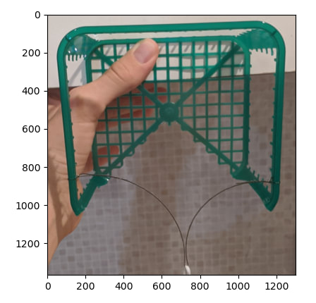
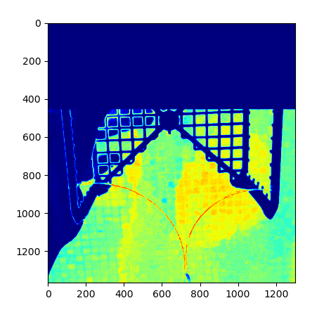
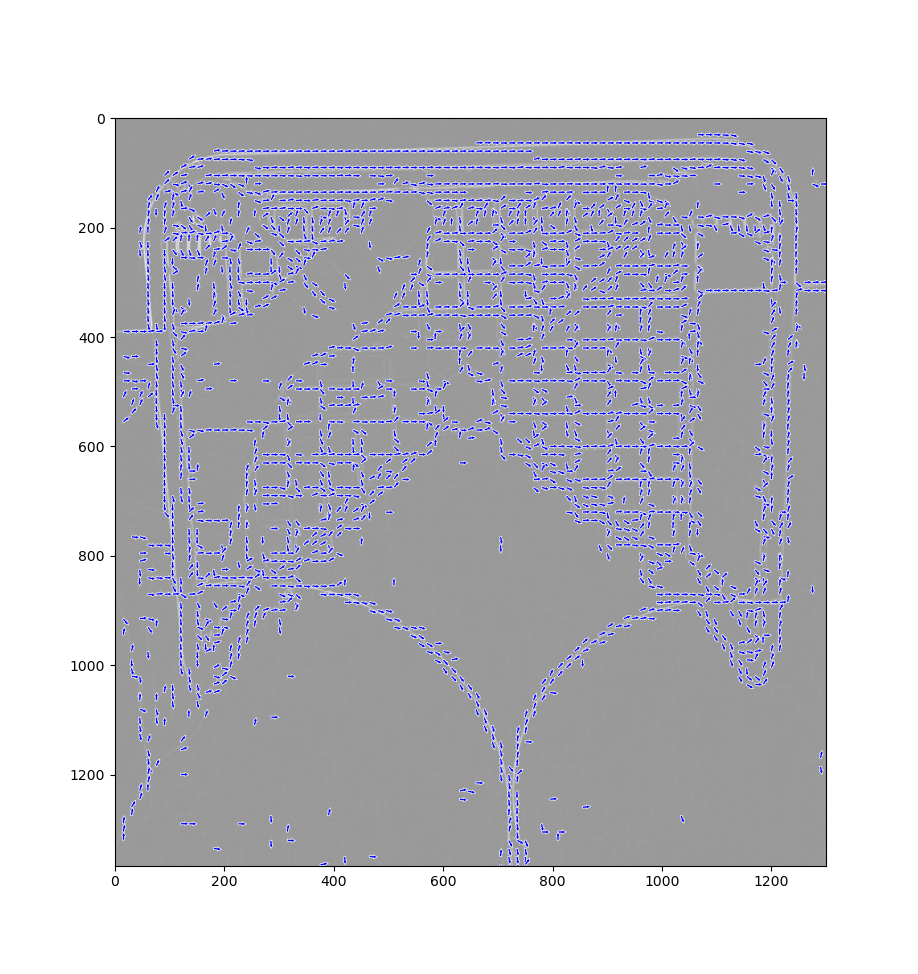
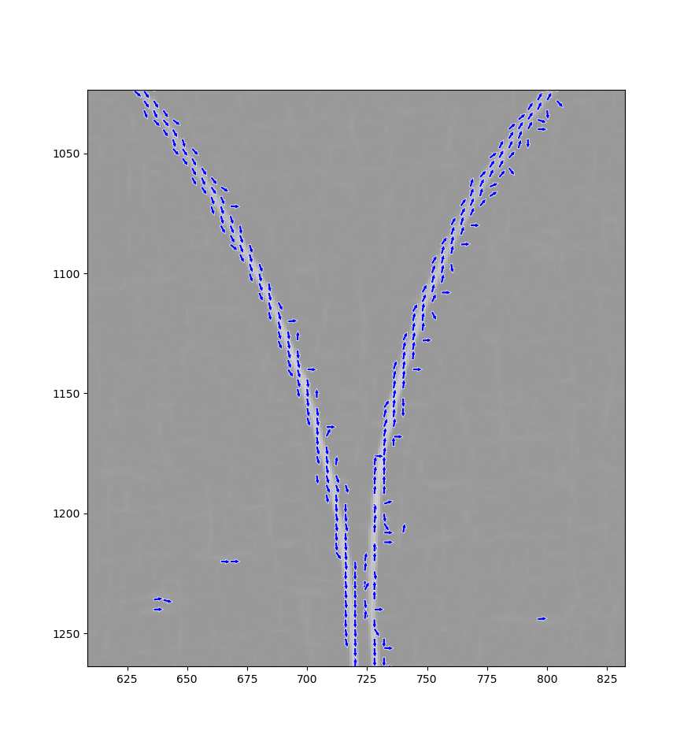
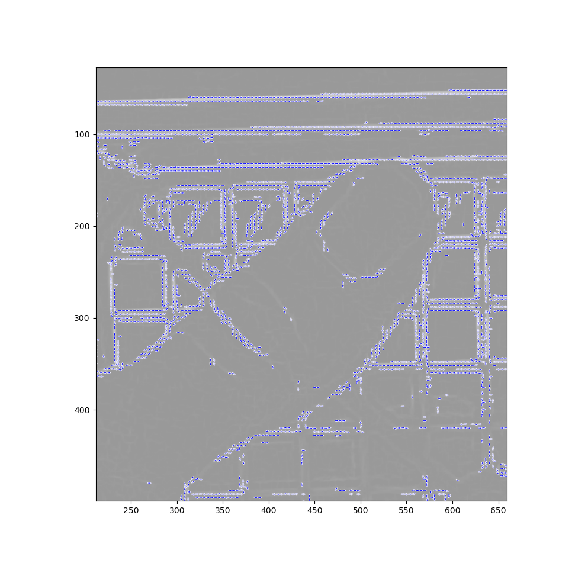

# work on line detection algorithm:

#### introduction

these are the line detection algorithms in chronological order. the original image is denoted with M.  
for example Id(M) = M, and GaussianFilter($\sigma=15$,M) = "a smeared version of M with Gaussian filter of standard deviation 15".

#### origenal image

this one is a color image

||
|:---:|
|*Origenal Image: $Id(M)$*|

*in this document we use the jet color map for scalar - to color comparison.  

||
|:---:|
|the jet colormap, left is low value right is high value|

#### line detector v1

this and probably all the following ones will be grayscale, printed with colormap=jet  

||
|:---:|
|*Line Detector v1: $Norm(id(M) - GaussianFilter(\sigma=15,M))$*|

the idea behind this filter is that it compares the current pixel to the average color of it's suaroundings. with this filter you expect to find all edges equally.

#### color & location score v1:

||
|:---:|
|*$ColorScore\_v1(M)*LocationScore\_v1(M)$*|

here is an image of a pixel scoring algorithem that is based on color and location of the pixel. the algorithem slightly prefers pixels that are close to centered around x, and greatly prefers colors that have no hue (to be perfectly honest the most prefered hue was set to be slightly red but mostly gray, because that is the color the the thread). also the top third of the image is removed at this stage because it's needless calculation.

!!temp `this is some pretty long inline code. yup, code code code. this is code.` yup

##### specifics of location score

```txt
y_rel = position[1]/image_size[1]
x_rel_centered = position[0]/image_size[0] - 0.5
if y_rel <= 0.35:
    return 0
LocationScore = np.exp(-x_rel_centered**2)
```

##### specifics of color score

```txt
# for every pixel the color is stored as RGB in an array called color
brightness = (color[0] + color[1] + color[2])/3 # between 0 and 1
red_shift = 0.05
std_of_hue_diff = 0.06
hue_score = np.exp(-((color[0]-(brightness+red_shift*2/3))**2+
                        (color[1]-(brightness-red_shift/3))**2+
                        (color[2]-(brightness-red_shift/3))**2
                    )/(2*std_of_hue_diff**2))
brightness_score = 1-brightness
ColorScore = (hue_score**2)*brightness_score
```

#### total pixel score v1:

||
|:---:|
|*$ColorScore\_v1(M)*LocationScore\_v1(M)*LineDetectorScore\_v1(M)$*|

we can see that this a very good start and that the two different methods work together to distinguish the line from the picture.

#### line detector v2:

||
|:---:|
|*$\frac{\nabla^2(M,dx=5)}{(\nabla(M,dx=10))^2}$*|  

this line detector is based on first and second derivatives of M. intuitively when trying to detect a dark thin line the first derivative of M will in the area of the line be 0 and the second derivative of M will be very positive (not negative, because the line is darker than it's surroundings). meanwhile at any other edge (for example the edge of the green plastic) the first derivative will be larger than the second derivative. thus the most sensible thing to do is divide the two.

###### in detail:

||||
|:-:|:-:|:-:|
||||
|image of magnitude of gradient|image of laplacian|image of positive parts only of laplacian  
(with minval = 0)|

the laplacian has some very negative values, (which do not bother the edge detection) but as can be seen might bother the printing, so, when printing, I use vmin=0 which sets all the negative values to 0 for the print.

###### derivative calculation (first and second)

the derivative is calculated via convolution with a 2d complex kernel. the 2d complex kernel is just a mathematical trick to allow calculating x and y derivatives at once. so the 2d complex kernel is just a perpendiculat duplication the folowing 1d kernals for 1'st and 2'nd derivatives: 

for the second derivative it also makes sense to draw the resaulting 2d kernel 

#### total pixel score v2:

||
|:---:|
|$ColorScore\_v1(M)*LocationScore\_v1(M)*LineDetectorScore\_v2(M)$|

I do have ideas for improovment, but it seems this is good enough, so I'm gonna start working with this and maybe improve this later.

I run this on some other image and got results that are just a good: 

#### ideas for improvment:

if instead of using the [two convolution kernels in line detector v2](#derivative-calculation-first-and-second) we can use only a single kernel, that "fits" the line detection:  this is what I do in [line detection v3.0 - v3.6](#line-detection-v36)

#### location score v2:

from looking at the images, it seems that I can cut off all the upper half of the image instead of the upper third. so

###### specifics of location score v2:

```txt
    y_rel = position[1]/image_size[1]
    x_rel_centered = position[0]/image_size[0] - 0.5
    if y_rel <= 0.5:
        return 0
    LocationScore = np.exp(-x_rel_centered**2)
```

#### line detection v3.6:

this line detection method hase one paramitter called line_width. it uses foure kernels, one for horisontal lines, two for diagonal lines and one for vertival lines. here is an image of the kernels for differant line_widths:  here is an image of the resulting line detection preformance: 

[reed more](line_detection_v3_specifics/line_detection_v3_worklog.html)

#### total pixel score v3:


||
|:---:|
|$ColorScore\_v1(M)*LocationScore\_v2(M)*LineDetectorScore\_v3.5(M)$|

I manually extracted a binary array that defines the string (the string here is thin, I generally inflate it when needed later): 

with this I can compare the different Performances. I draw a few graphs with some score histograms. the first is a pair of histograms of the absolute number of pixels in each score, in two different regions in the image. the region that is close to the string and the region that is far from the string.  
the second is a pair of density histograms (normalized so that the integral is 1) of the distribution of scores, in two different regions in the image. these two graphs hold the same information, but show it in very different ways.  

||
|:---:|
|in blue is the noise, in red is the signal, y axis (log scale) is the amount of pixels in each color, x axis is the score of the pixels|

||
|:---:|
|in these figures, there are several histograms of the score-values seen in the result image of the string-detection-algorithm when applied to picture #01. in blue is the scores of the noisy background. in red is the score of the string region. the SNR in this system is the ratio of the average signal (red line) and the maximum noise (blue line)|

unsurprisingly the pixels that are closer to the string score higher on average. and also unsurprisingly, the snr is best when the line width is equal to the strings actual width which is around 4~5. this aligns with the results in the v3.1/3.2 paragraphs in [line_detection_v3_worklog](line_detection_v3_specifics/line_detection_v3_worklog.html#v32). this is shown in the following graph

||
|:---:|
|the snr as a function of line width. the maximusm is clearly visible at "line_width=5"|


#### line detection v4

I realized that in line_detection_v3 I use 4 kernels, each of which is tailored to detect lines with different angles. I could use the relative values of these kernels to predict the angle of the line at some point. this is what I do in [line_detector_v4](line_detection_v4_specifics/line_detection_v4_worklog.html) with great success:

|||
|:-:|:-:|
|||
|||

although this is objectively really cool, and I surely could improve the string detection by using this angular data, I have decided that using this would make the string detection more complex, and I think the string detection would probably be good enough without the angular data.

#### total pixel score v3.2:

uses line detection v3.7 instead of line detection v3.5.
this has minor performance improvements
