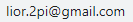
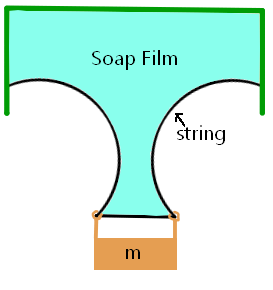
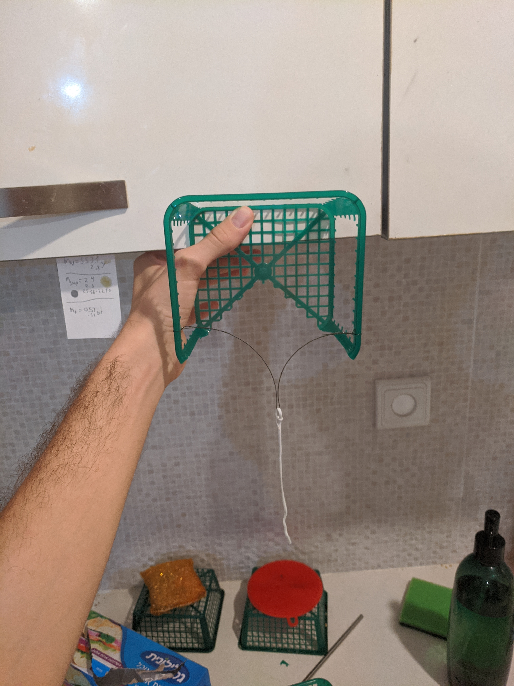
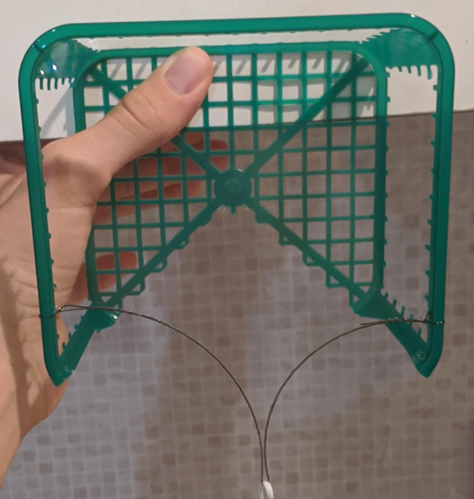
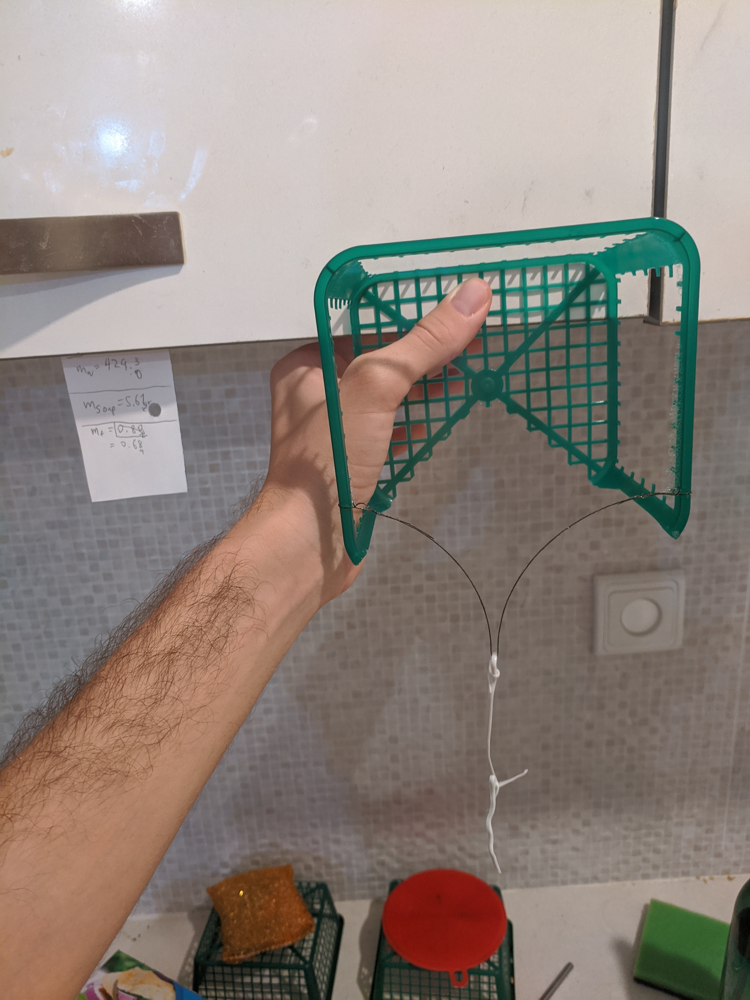
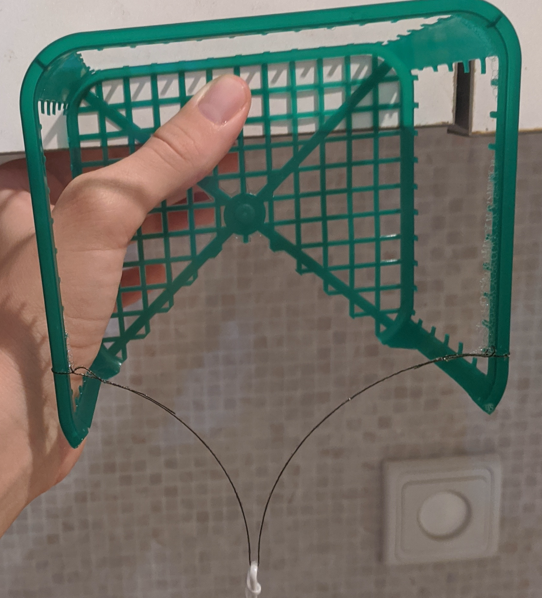

# measuring surface tension of soap film with image processing algorithms

 *The code used for the processing of this experiment is available at [My Github](https://github.com/LiorAvrahami/surface-tension-measurement-project)

>contact info:  
 written and conducted by *Lior Avrahami*   
 email (it's an image to protect against bots): 

## introduction

In this work I measure the surface tension of different Concentration solutions of water and [echo dish soap](analysis/echo_friendly_soap_image.png). I do this by measuring the total up force a soap film applies on it's lower boundary which consists of a black, tensioned string. the string is tensioned via a small 0.5-2 gram weight. 

||
|:---:|
||

for further detail of the Theory see [The Theory Page](analysis\theory.html), there it is shown and explained that the surface tension is equal to $\gamma = \frac{mg}{D}\\$ where D is the distance between the centers of the circles. I happen to have a very accurate weight gauge, and so the hard part of this experiment is acquiring with high accuracy the distance between the centers of the circles. to do this I took 80 pictures of the string with different weights and different Concentration solutions and applied string detecting, perspective reversing, and curve fitting algorithms to acquire the true parameters of the circles.

|||
|:--:|:--:|
|||
|picture #01|relevant cropped part of picture #01|

|||
|:--:|:--:|
|||
|picture #15|relevant cropped part of picture #15|

** from here on I almost always refer to the cropped images simply as "the images"

## string detection

in order to detect the string out of the picture, I applied several filters that help the string **"pop out"**, or in other words, I apply some string detecting filters to the images:

1. location based: the top half of each image was given score 0
2. color based: I used a distance filter centered around the color of the string which is black with a slight red shift. the score is a 3d to 1d function that is a 3d gaussian centered around the string color.
3. line detection based: I used convolution with several kernels to help detect the string. I also managed to extract the strings angle at every pixel from the different of these 4 kernels. the kernels depend on a width parameter called "line_width", which represents the width of the string in pixels.

||
|:---:|
||
|the 4 kernels have a width parameter called line_width. in this figure each column shows the 4 kernels with a different line_width value.|

||
|:---:|
||
||
|in these figures is the "string_detection_score" which is the result of multiplying all three filters, with different values of line_width|

||
|:---:|
||
|in these figures, there are several histograms of the score-values seen in the result image of the string-detection-algorithm when applied to picture #01. in blue is the score of the noisy background. in red is the score of the string region. the SNR in this system is the ratio of the average signal (red line) and the maximum noise (blue line)|

||
|:---:|
||
|the snr as a function of line width. the maximum is clearly visible at "line_width=5". thus, "line_width=5" is the value that was chosen from here on|

a more detailed explanation, along with the different approaches I tried before reaching these results, are available in the [The Line Detection Page](line%20detection\line_detection_worklog.html)

#### local angle detection - line_detector_v4

I would also like to mention another feature I implemented and did not end up using called line_detector_v4, which is a form of local angle detection. for any point on the string, I use the relative values of each of the 4 kernels, to determine the direction of the string in the point. enabling me to present the following arrow chart figures:

|||
|:-:|:-:|
|||
|||

for more info about this local angle detection method go to [line_detector_v4](line%20detection\line_detection_v4_specifics/line_detection_v4_worklog.html)

## undoing perspective effects

I found perspective effects to be significant in these pictures, these effects are caused by non-negligible deviations in the cameras orientation from being perpendicular to the plane of the film. for example, in picture #01, this caused a 110% - 108% stretching effect of the x axis relative to the y axis, as can be seen in the following figures:

|||
|:--:|:--:|
|||

so, the perspective effects, really screw up all the circles and the distances in the picture, thus in this work I undid the perspective distortion effects, by calibrating the perspective transformation coefficients and applying the reverse transformation to the points in the image.

### theory of perspective transformation

naively, if I wanted to create a perspective-distorted image of some picture, this distortion would have 2 parameters. but since perspective is not the only transformation applied to the picture, and because all these transformations build up on and interact with each other, we end up needing to take them all into account and end up needing 6 parameters for the complete transformation. the parameters are:

|transformation|first parameter|second parameter|
|:--|:--:|:--:|
|perspective transformation|camera angle of attack x|camera angle of attack y|
|rotation transformation|camera xy rotation angle||
|converting pixels to cm|scale||
|translating plastic-frame to the center of the image|translation_x|translation_y|

simply put, perspective makes further things smaller. where "further" corresponds to the distance of the point to the plane of the camera (the geometric height). if we are dealing with a system where all the points to be recorded in the transformed image are constrained to lye on some plane in 3D, then we can derive some relationship between x, y, and the distance from the camera's plane. so, you get an effect where things are shrunk down in some direction relative to others. also, since the plane of points is at an angle to the cameras plane, you get that some direction is squished and its perpendicular direction is not.

for more information see [Perspective_Theory](analysis\Perspective_Theory.html)

### gauging the perspective transformation coefficients

to preform the reverse perspective transformation, it is first necessary to find the perspective transformation coefficients. to find them, I did the following:

1. I marked 4 points on the corners of the plastic frame.
2. I measured the distances between every set of two points (6 distances total)
3. I used the distances I measured, and a global implementation of scipy.minimize, to find the locations of each of these 4 points, with accuracy of 0.1mm.
4. I wrote and used a script to help me manually mark each of the 4 points on each of the 80 images.
5. now, for an arbitrary image of these 80, I find the true perspective transformation coefficients, by running an optimization algorithm (global implementation of scipy.minimize) on the parameters. given a set of parameters, I score how good they are at representing the real perspective transformation for this picture. to score a set of parameters, I define a pseudo transformation, which is the perspective transformation defined by this set of parameters, I apply this pseudo transformation to the real frame points, the ones defined from segment 3 of this list, to get points in the image coordinates. I compare these points to the points I marked on the image and add up the distances to get a score. low score means good fit.
6. after the parameters of a good fit are found, I calculate the reverse transformation (this isn't that trivial but is quite straight forward), and apply it to the points in the image to get the corresponding point in real-plastic-frame-coordinates, with cm units.

|||
|:---:|:---:|
|||
|distances that were measured with a ruler on the real plastic frame|the frame points defined from segment 3 of this list|

|||
|:--:|:--:|
|||
|string points in image coordinates (before reverse perspective transform)|string points in real coordinates (after reverse perspective transform)|

### clarification

I feel the need to clarify. I select points in the image, apply the reverse  perspective transformation on them to get them in the real soap-film's plane coordinates, and fit circles on to these points. I always only fit circles to points in the soap-films coordinate system, which is also already scaled to be in units of cm. later in this document, you will se figures of distorted circles drawn on top of the image, what I do there is take the circles after they were fit in the soap-film's plane, and apply the perspective transform to them i order to be able to plot them on top the original image.

## extracting points & circle fitting

from [string detection](#string-detection) I have a slightly noisy image of the string, and from [undoing perspective effects](#undoing-perspective-affects) I have a function that when supplied with image coordinate points, gives back real world coordinate points with no perspective effects and in [cm]. what's left is a method to extract points from the image, and a method to fitting circles to the points in real coordinates.

### extract points from the line detection results

to extract points from the image I simply make two sweeps over the picture. the first is a horizontal sweep, in which, for each column I take the point with the highest line detection score. and the second is a vertical sweep, in which, for each row I find and extract the two largest local maxima. after sweeping in both directions, I split the points into two groups, left, and right, and apply the circle fit to each group separately.  

||
|:---:|
||
|scatter plot of the points extracted from the line_detection on image_01. in red are the points that are extracted from the left line, and in blue are the points that are extracted from the right line.|

### circle fit

it is not, in general possible to fit a circle arc with regular function-fit algorithms, because a circular arc is not always a function (could have two y values with the same x). but I didn't want to work hard on developing a general method to fitting general curves, and could not find a simple general solution online, so I came up with the solution of fitting the circle arc in polar coordinates. as long as I place the origin of the polar coordinates inside the circle, the circle will be a true function. since for all images the two lower corners are inside their respective circles, they were taken to be the origins of the polar coordinate systems (the left lower corner of the image is the polar origin of the fit for the left circle and the the right lower corner the origin for the right circle).

|pic number|fit circles drawn on image|left fit in polar coordinates: x is radians, orange is blue shifted by 2pi, y is distance|left fit results: in red is the fit results, in blue is the initial guess|right fit in polar coordinates: x is radians, orange is blue shifted by 2pi, y is distance|right fit results: in red is the fit results, in blue is the initial guess|
|:---|:---:|:---:|:---:|:---:|:---:|
|04||||||
|06||||||
|10||||||
|75||||||

you can reed more about my previous less successful iterations of the analysis in the [Analysis Documentation Page](analysis\analysis_worklog.html)

## results

for each image, I calculated the distance between the circles, and plotted the results in the following figure:

||||
|:---:|:---:|:---:|
||||

||
|:---:|
|three zoom levels of a meta figure where every image of the soap-film-string-mass system is a single point. the x axis is the weight of the mass, and the y axis is the distance between the circle centers. the blue points are ruffly 0.5% soap, the orange lines are ruffly 0.6% soap and the green lines are ruffly 1.3% soap. for each set of points with the same soap concentration, a linear regression that is constrained to go through 0 was calculated, and from that regression, the surface tension was extracted, in the figure denoted as ST|

here are the results in table form:

|part soap|surface tension [dyn/cm] - 68% confidence interval|
|:--|:--:|
|0.449%|47.28 - 48.05|
|0.590%|51.45 - 52.13|
|1.307%|48.44 - 48.96|

in the following figure I plot up these numbers, along with the results I found online:

|||
|:--:|:--:|
|||
||

||
|:---:|
|two zoom levels of a figure of the different surface tensions I measured for the different concentrations of soap in soapy water films. the x axis is mass-percentage of soap, the y axis is the surface tension I measured, in [dyn/cm]. the red dotted line is the surface tension of water, and the green dotted line is the surface tension in the soapy solutions I found online.|

## conclusion

in conclusion I successfully measured the surface tension of soapy water film to a degree of uncertainty of 0.5% with these three measuring devices:

1. a simple mm ruler
2. an amateur jeweler's digital weight gauge that goes up to 100gr and with a sensitivity of 5 milligrams
3. a phones camera
  
as you can see, the results I got don't reproduce the ones found online, but do reside between those of soap and those of regular water. this Discrepancy is very likely because I used a different type of soap to the one scientist use when measuring this stuff. let it be said that I regret doing this experiment with the echo-friendly dish soap lying around my house, the composition of which I can't even start to guess. on the upside, I might have been the first person ever to have measured the surface tension of echo-soap-water solution.  

 *The code used for the processing of this experiment is available at [My Github](https://github.com/LiorAvrahami)
