# analysis work-log

## soap type

## units

in order to be able to convert from pixels to length units (cm) I manually marked the edge-points (with automation assistance) of the plastic frame for all the pictures. here is an example image:

||
|:---:|
|in red are the edge points that I marked manually|

I measured the real world length between these points and found it to be: $$119mm\pm1$$

for [extract_curvature_v2](#extract_curvature_v2) I ended up using some other frame measures as well in order to extract the angling of the shot (for perspective analysis):
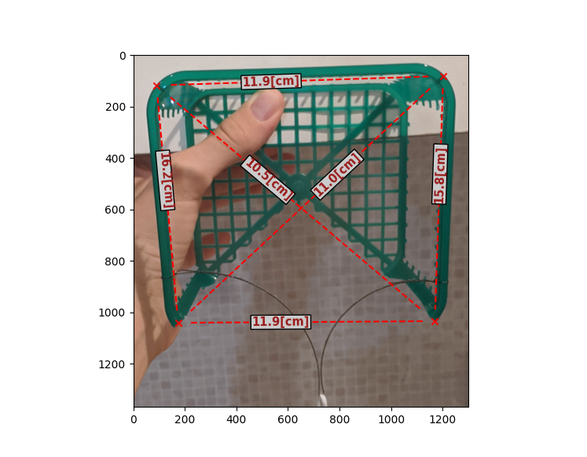

## analysis

the analysis consists mostly of extracting the radius of curvature of the string.
this is of course done after using the line detection method that is described in [line_detection_worklog](../line%20detection/line_detection_worklog.html)

I tried several iterations of curvature extracting algorithms, which are called by a common script which iterates over all the images, applies the latest [line detection method](../line%20detection/line_detection_worklog.html) which is v3.2 (score_pixel_v3p2) and then tries to extract the radius of curvature from the line-detection-score image. now I will describe the different curvature extraction methods I had tried:

### extract_curvature_v1

this method uses the global minimum search optimization algorithm called "scipy.optimize.minimize" to find the 4 parameters that define the ellipse that fits the curve best. only 4 paramitteres are used and not the usual 5 because it is assumed that the elipses major and minor axes are aligned with the xy axes. this assumption is of course an approximation.

#### score function

the score function is the function that is given a set of ellipse parameters and returns a score of how well these parameters fit the image.
the score function I initially used, is a score function I made up, which is the dot product of the line_detection_result with a synthesized image of the ellipse that is made from the given parameters. the ellipse is made to be more "real" and more "forgiving" by applying a gaussian smearing filter to it. the following are figures of this ellipse, synthesized from the ellipse parameters.

|||
|:---:|:---:|
|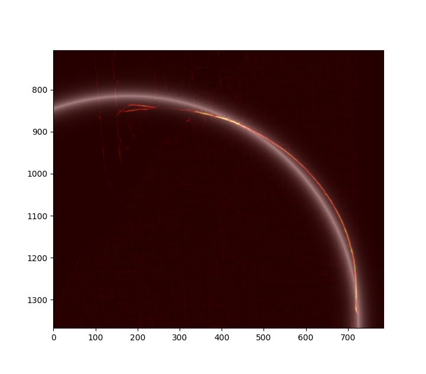|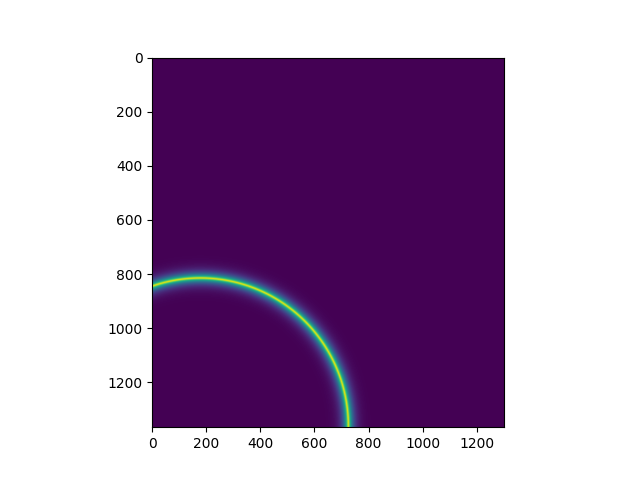|
|close up on the sinthetic ellipse on top of the real line detection results| the sinthetic ellipse, in the intire frame, blur sigma = 15px|

#### extract_curvature_v1 : fit quality

in the following table are some of the fit results, on the original images.
as you can see some appear very good and some appear very bad. this is true for all the pictures, the fit results are either quite good or exceptionally bad.

||||
|:---:|:---:|:---:|
|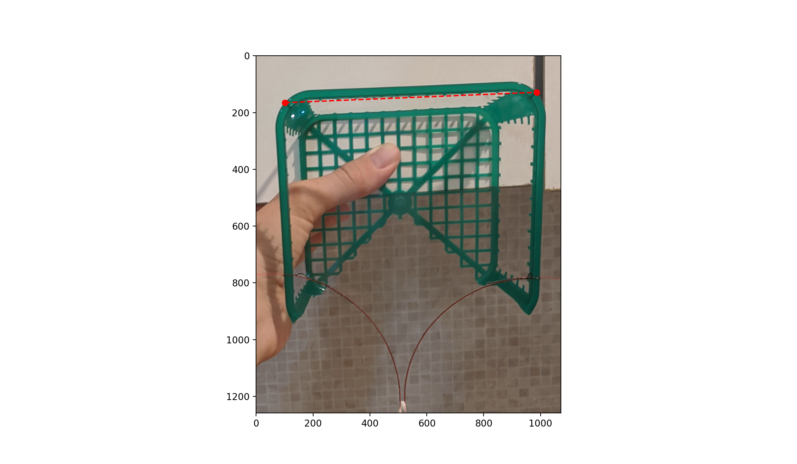|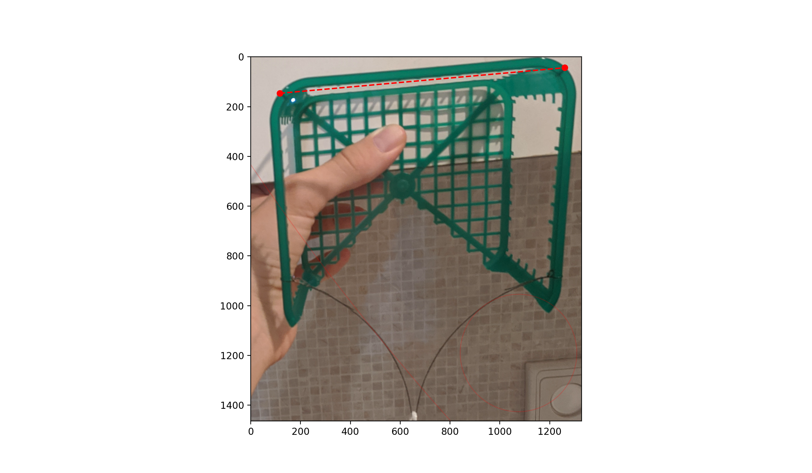|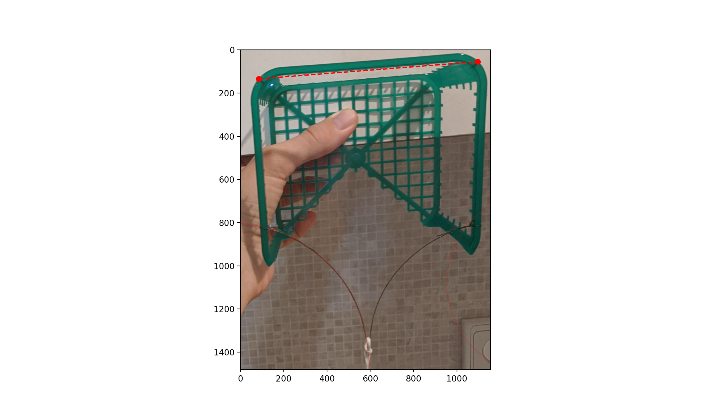|
|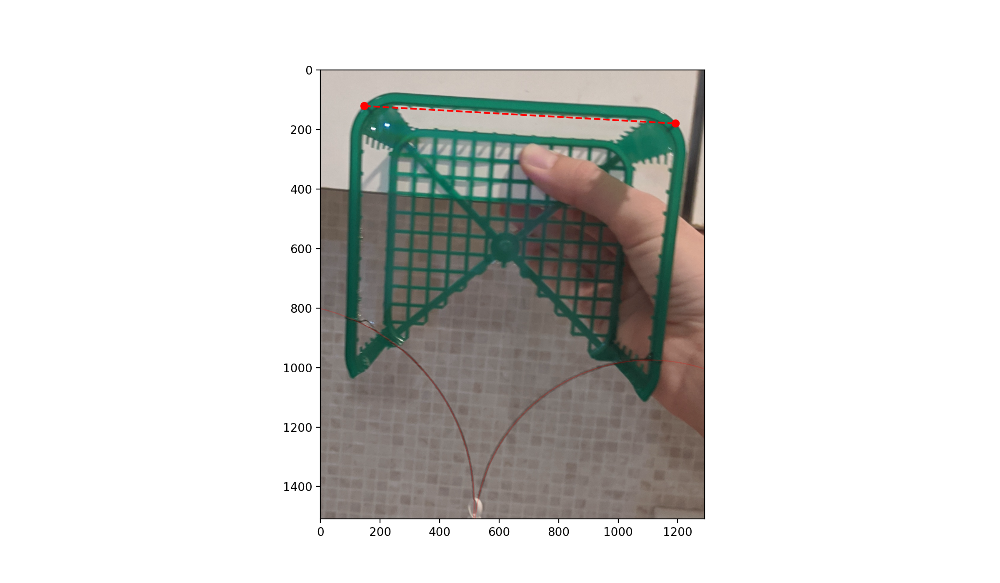|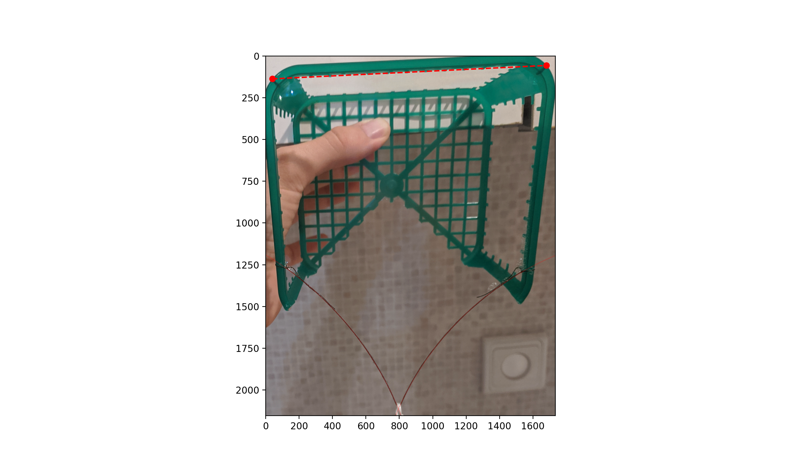|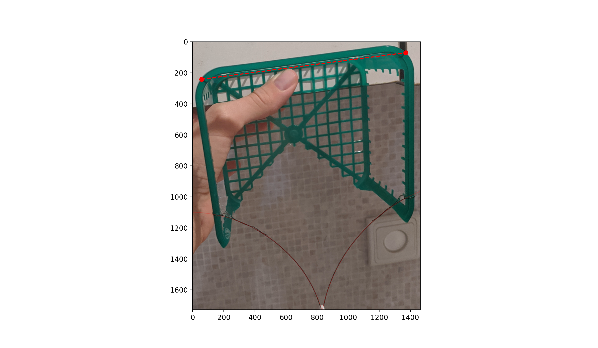|

#### extract_curvature_v1 : radius parameter quality
|||
|:---:|:---:|
|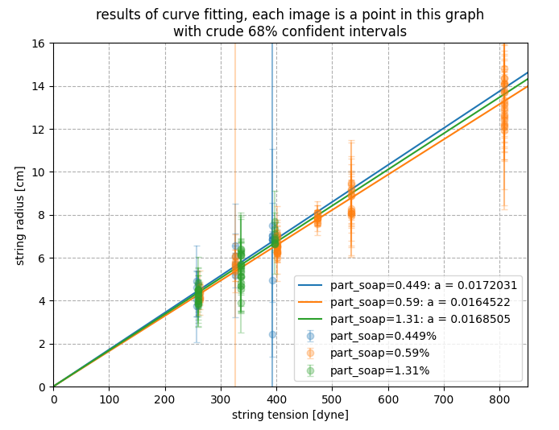|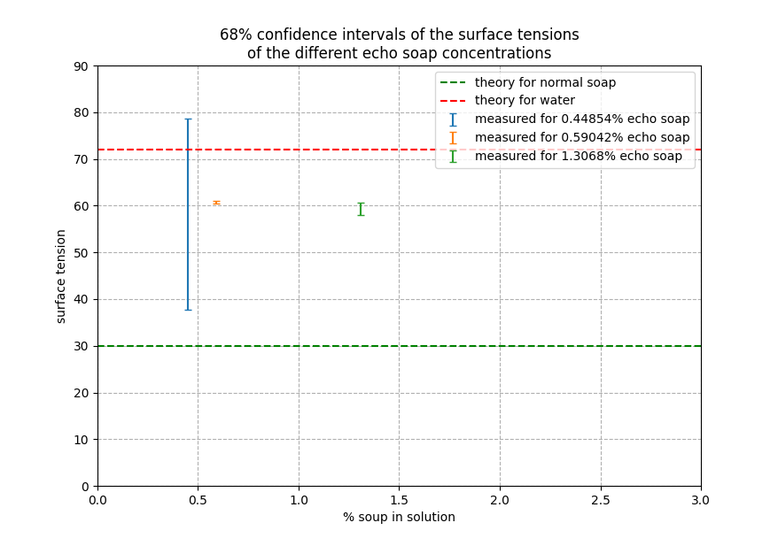|

it appears from the right figure that the surface tension of the echo-friendly soap is twice that of normal soap, bust still in the region between soap and water. from these results it can not be deduced that the surface tension changes with soap concentration.

### extract_curvature_v2
making my own curve fitting function based on scipy minimize was not a good idea, mainly because finding a score function for an optional curve, layed on an image is not that trivial, and The method I chose is probably not great.

so I decided to try a different approach altogether: I extract a bounch of points from the line_detection_score_image, and fit a circle function with scipy's curve_fitting function, on to those points, with the weight of each point being equal to the line_detection_score_image's value at that point. the only problem with this is that the string's curve is not gaurentead to be a function of x or y. so What I ended up doing is transform the points to polar coorrdinates around some crudely estimated center point. in these polar coordinates the curve is almost defenetly a function of theta, and so now I can fit these points to the equation of an of centered circle in polar coordinates, wich is: (I explain why i used a circle and not an ellipse , later)

$$
 r\ =a\cos\theta+b\sin\theta\pm\sqrt{\left(a\cos\theta+b\sin\theta\right)^{2}+R^{2}-a^{2}-b^{2}}
$$

I used a circle instead of an ellipse because I wanted to have as little coefissients as possible inb the fit optimization process, and because the above equation would become segnificantly more complex for an ellipse. 

initially I tried ignoring the elipticity of the string, to see what would happen, here are the results for the first picture (image_01):

||
|:---:|
|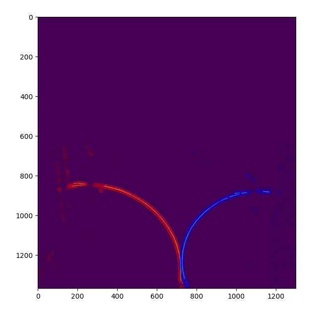|
|scatter plot of the points extracted from the line_detection on image_01. in red are the points that are extracted from the left line, and in blue are the points that are extracted from the right line.|

||
|:---:|
|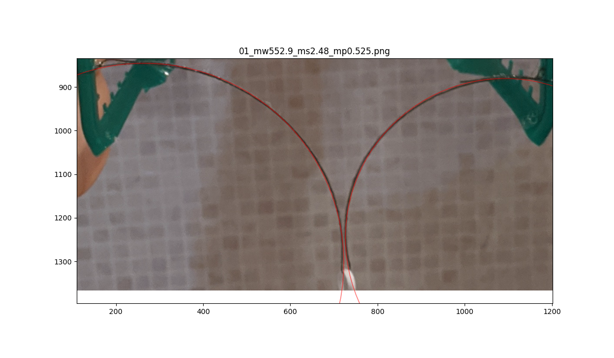|
|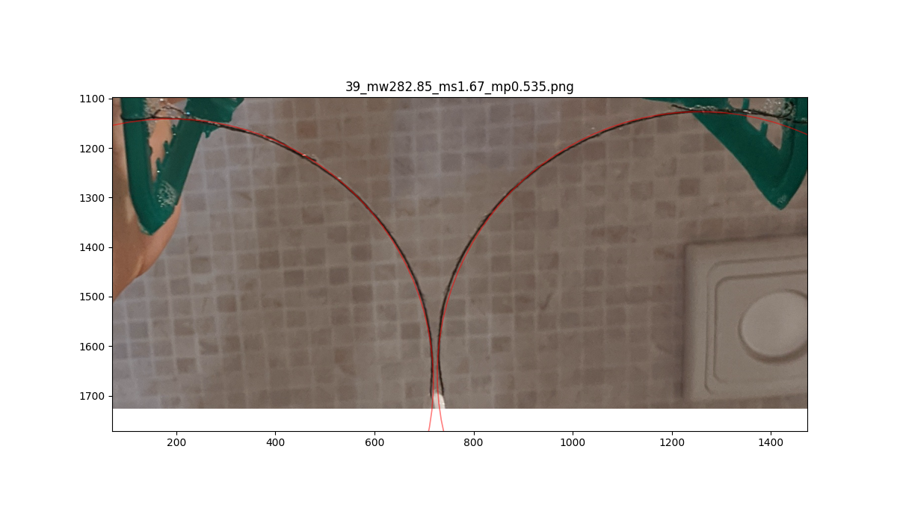|
|example results of optimal circle detection. it can be noticed that the results are of quite low quality. it seems that not even the most optimal circle can manage to fit these curves well|

so now comes the question, are the strings in these pictures really ellipses? and if so, by how much?

#### perspective

so I went ahead an mesured the x,y, scaling ratio, via measuring the major-minor-axes-ratio of the string, and the width to height ration of the frames grid, as can be seen in the following figures, the rasio is around 108%~110%

|||
|:--:|:--:|
|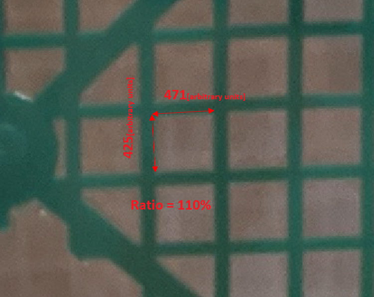|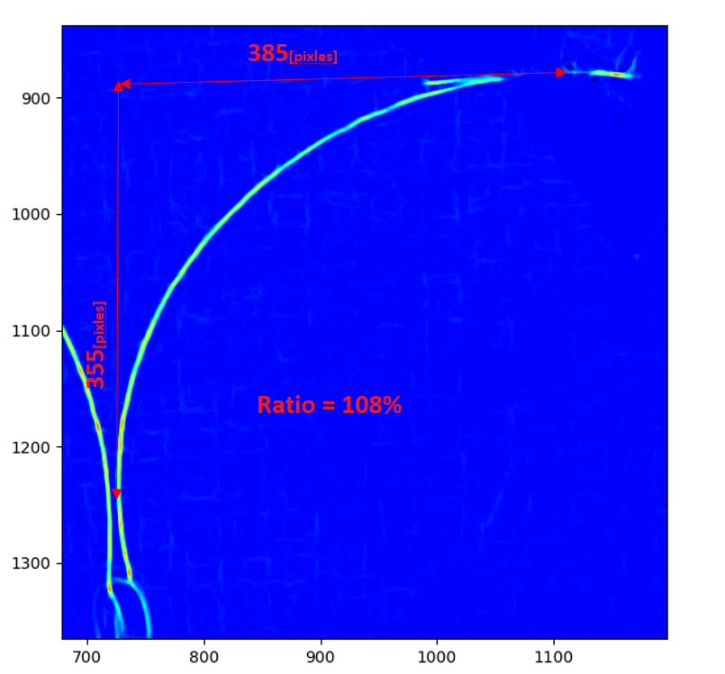|

wich means two things. the ellipticity is defenetly important, and it can be deduced from the frame, and thus doesn't need to be extracted from the already difficult enough curve fit. this means that in the analysis of this problem I have to take perspective effects into account.
so in order to accomadate for the perspective affects, I need to characterize some perspective affects parameters. in this problem the picture I'm interested in (the frame and the string) are all in one plane. the theoretical part of how a plane is transformed as a result of perspective is detailed in [Perspective_Theory](Perspective_Theory.html). the result is some function that depends on some 4 parameters. in order to find these perspective geometry parameters was as follows:

1. I measured the distances of the 4 constant points on the real actual frame from one another, shown in [Units](#units)
2. I used scipy.optimize.minimize in order to find the best 4 sized shape that fits these distances. there is of course a redundancy in data used to characterize the location of these points with higher accuracy. the points that were reached are shown in the figure below
3. I manually marked to these 4 points in all the 80 pictures (using some automatic script to help make the process easy)
4. for each picture I used scipy.optimize.minimize in order to find the perspective geometry parameters that best transfer the 4 measured points to the 4 points in the picture.

||
|:--:|
|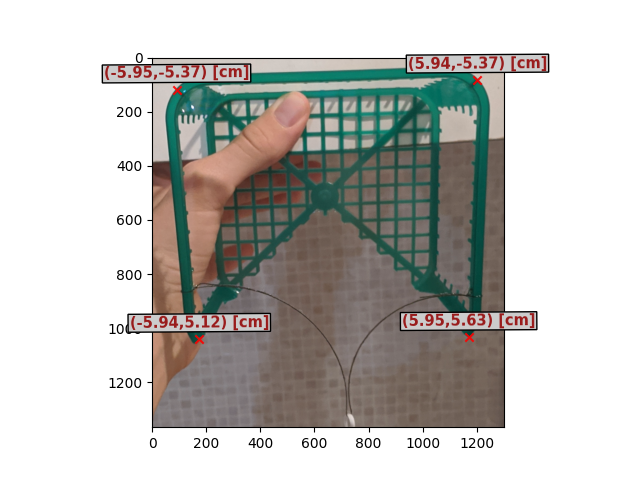|
|the locations of the real points on the frame reletive to some center point, the estimated uncertainty of the fit is around 0.1 mm|

after I found the perspective geometry parameters for some picture, I can a reversed transformation to the string points on that picture, this transformation fixes the perspective issue and maps the string points to a perfect circle.

|||
|:--:|:--:|
|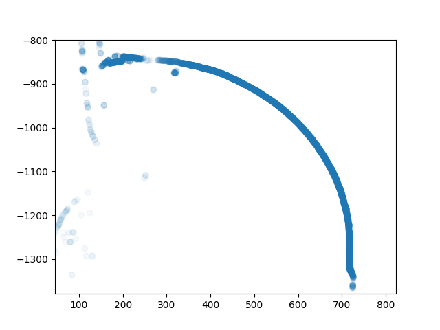|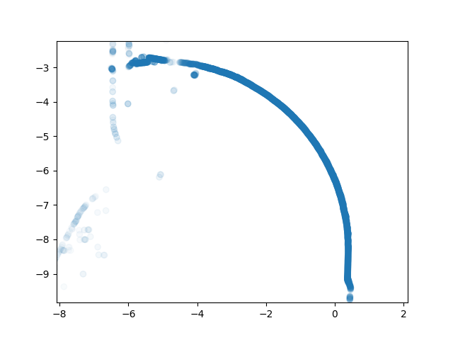|
|string points in image coordinates (before reverse perspective transform)|string points in real coordinates (after reverse perspective transform)|

#### extract_curvature_v2 : fit quality

in the following table are some of the fit results, on top the original images. note that I do the circle fit after the perspective fix to the string points, and then, for the sake of these pictures only, I transform the circles back to the image corrdinates. this distorts the circles and makes them not circular in the following pictures, looking at the distorted circles allows you to appreciate how important the perspective transforms were in order to achieve got circle fits from these pictures.

|pic number|fit circles drawn on image|left fit in polar coordinates: x is radians, orange is blue shifted by 2pi, y is distance|left fit results: in red is the fit results, in blue is the initial guess|right fit in polar coordinates: x is radians, orange is blue shifted by 2pi, y is distance|right fit results: in red is the fit results, in blue is the initial guess|
|:---|:---:|:---:|:---:|:---:|:---:|
|04||||||
|06||||||
|10||||||
|75||||||

#### extract_curvature_v2 : radius parameter quality
|||
|:---:|:---:|
|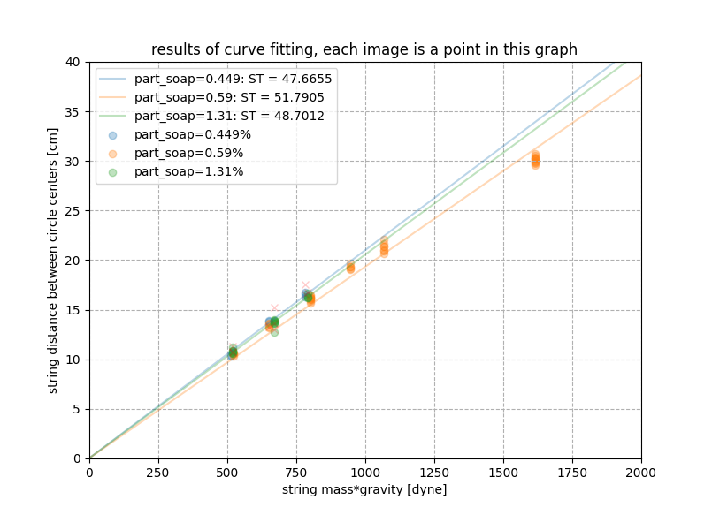|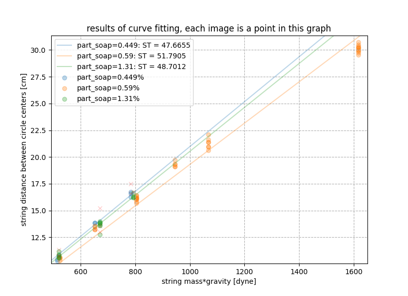|
|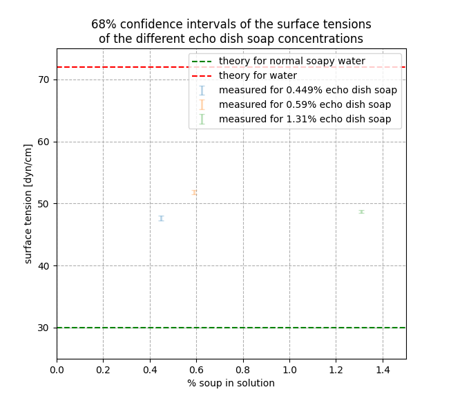|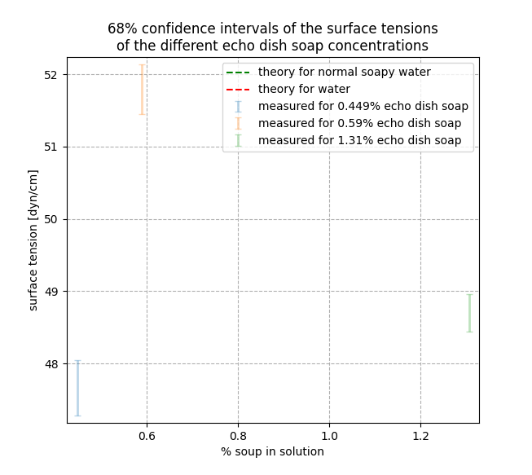|

## appendix

I found that the left and right radii were in general not equal for all pictures. in fact, there seems to be a bias, towords the left radii being bigger than the right radii, this indicates that the left part of the string is at tighter tension than the right part. when thinking over a reason for this, I reached the conclusion that the weights' center of mass is not centered, but slightly offset to the left. in order for the system to reach equalibrium, the moments as well as the forces have to sum up to zero. this leads to the load on to the left part of the string being greater than the load on the right part. seeing as this possabuility was taken into account, this has no damaging affect to the results/conclusions.

||
|:---:|
|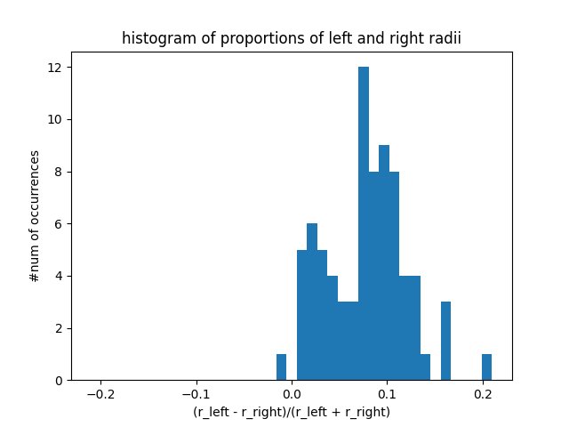|
|as is shown here, the left radius is generally 110%-130% larger|

||
|:---:|
|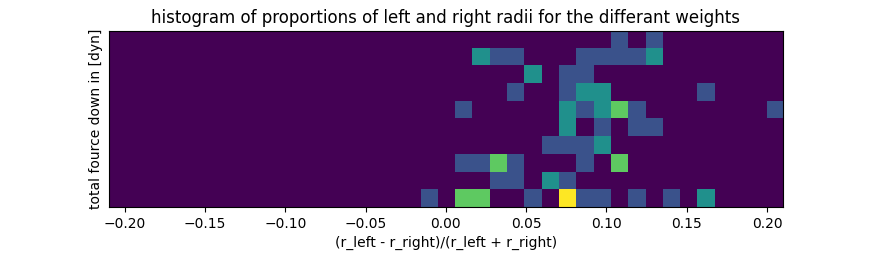|
|as you can see, the different weights appear to maybe have different biases, wich would corrispond to differant offsets to the center of mass, but this doesn't appear to be somthing that cen be conclusivly decided.|