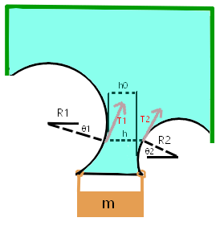
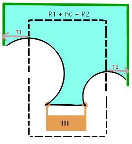
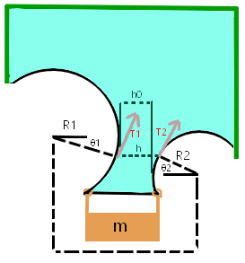

### Theory Workout

#### relation between the string tension and local curvature

given liquid film with a string boundary, we want to work out the relation between the string tension and local curvature.

||
|:--:|
||

the fources must be at equalibrium on a string segment of length dL. around this point the string is aproximated to be a circular arc with radius R. thus $dL = R\,d\theta$  
equalibrium:  

$$\begin{gathered}
F_\gamma = T_{Tot} \\
2\gamma\,dL=T_r\sin(d\theta) + T_L\sin(d\theta)=T_r\,d\theta + T_L\,d\theta\\
\text{but the equalibrium along the tangent requires} \,\,T_r = T_L \equiv T\,\, \text{and thus}\\
2\gamma\,R\,d\theta = 2\gamma\,dL = 2T\,d\theta\\
T = \gamma\,R
\end{gathered}$$

finally, since our string is For all intents and purposes, massless, and since it is a well known fact that a massless string's tention is uniform (constant along the string), we can deduce that the radius of curvature of the bounding string will also be constant. that is to say the string will form a perfect circle.

#### solving the mass-string-film system

we wont to derive the surface tension as a function of the weights mass, m, and the form of the two circles that the string forms, in the following sketch of the setup:

||
|:---:|
||
|let it be noted that h is always completly hoizontal, and thus $\theta_2$ is some function of $\theta_1$. it will be demenstrated later that the specific dependence of these two angles, is not important. h0 is the distance between the projections of the circles on to the x axis.|

**you might have noticed that this sketch is impossible because there is a total force to the right on the mass (which is assumed to be at rest), the total fource is a result of the fact that there is a height at wich the two tangents of the circle point the same way on the x axis. this revelation leads to the conclusion that the two circles' centers must have the same y coordinate. but since this result is not needed here, we will make no such assumption, we allow the circles to be two general circles, because it doesn't matter at this point.*

###### simple solution

||
|:---:|
||

as shown in the sketch, we shall encolse the mass and a portion of the string and film in an imagionary incasing (the dashed line). since this system is static the total external fource on this incasing in the up/down direction is zero. since the strings fource is only in the x direction, the only fource in the y direction is the film on the top edge of the rectangle enclosure. that is to say:

$$mg = F_{down} = F_{up} = \gamma ( R_1 + h_0 + R_2) $$

if for some reason you don't belive this solution because it's to simple for you, the following is a more algebric/trigonometric approch.

###### algebric/trigonometric solution 

||
|:---:|
||

as shown in the sketch, we shall encolse the mass and a portion of the string and film in an imagionary incasing (the dashed line). since this system is static the total external fource on this incasing in the up/down direction is zero. thus we get:

$$\begin{gathered}
mg = F_{down} = F_{up} = T_1 cos(\theta_1) + h\gamma + T_2 cos(\theta_2)\\
\text{the geometric relation between h and the other values is:}\\
h = R_1 - R_1 cos(\theta_1) + h_0 + R_2 - R_2 cos(\theta_2)\\
\text{thus we get:}\\
mg = F_{down} = F_{up} = T_1 cos(\theta_1) + \gamma [R_1 - R_1 cos(\theta_1) + h_0 + R_2 - R_2 cos(\theta_2)] + T_2 cos(\theta_2) = \\
= \gamma(R_1 + h_0 + R_2) + (T_1 - R_1\gamma)cos(\theta_1) + (T_2 - R_2\gamma)cos(\theta_2)\\
\text{but, have shown in the last section ("relation between the string tension and local curvature"), that:}\\
T = \gamma\,R\\
\text{and thus, the }(T_1 - R_1\gamma)cos(\theta_1) + (T_2 - R_2\gamma)cos(\theta_2) \text{ terms are all zero. and we get:}\\
mg = \gamma(R_1 + h_0 + R_2)
\end{gathered}$$

###### conclusion

$$
\gamma = \frac{mg}{R_1 + h_0 + R_2}\\
\text{but } R_1 + h_0 + R_2 = \text{the distance between the projections of the centers on the x axis} =: D\\
\text{}
$$

and an other thing is that as was mentioned before, because of the fact that the system is also static in the x direction, we get that the centers of the circles have the same y coordinate, so **D is actually just the distance between the centers if the circles**.

$$
\gamma = \frac{mg}{D}\\
$$

### expected results

using [this paper as a reference](https://arxiv.org/pdf/1711.07602.pdf#:~:text=Our%20measurements%20show%20that%20a,30%20mN%2Fm%20and%20increases.) [Surface tension of flowing soap films, written by Aakash Sane, Shreyas Mandre, and Ildoo Kim, November 22, 2017]

we find that on one hand, the surface tension of soapy water, could be dependent on the soap films width and the concentration of soap in the original soapy water solution. but on the other hand, for a soap film that is sufficiently wide, the surface tension becomes unaffected by the soap concentration and film width.
also it is stated that the surface tension for a wide soap film (of the soap kind they were using) is 30[dyn/cm].

### Approximations

1) is is assumed that the mass of the string can be neglected. I measured it and found it weighs less than a hundredth of a gram.

2) is is assumed that the mass of the soap film can be neglected. a back of the envolope calculation results in this being equal to an order of magnatud of a milli gram:

$$density\ water \times area\ of\ soap\ film \times width\ of\ soap\ film=\\
  1gr/cm^3 \times 5cm^2 \times 1\mu m \approx 1mgr$$ 

*I was thinking, this soap film is increadably thin, and yet it can hold some load, so I think it might be interesting to compare it's generated pressure to the tensile strength of other materials:

|material                      |stress before deformation in MPa|
|:----------------------------:|:----------:|
|surface tension of soapy water| 0.1        |
|concrete                      | 2          |
|plastics                      | 15 - 80    |
|cast iron                     | 130        |
|steel                         | 300 - 2000 |
