line detector v4 attempts to estimate the lines angle via the different fit-results of the different fit-kernels. to achieve this I plot the kernel sensitivity to the angle mismatch. this is simmilar to what I did for line detector v3, except there I plotted the fit value vs position and line width where as here I plot the fit value vs line angle for every kernel.

||image of line at some angle|fit val of x kernel|fit val of diag1 kernel|
|:---|:---:|:---:|:---:|
|||||
||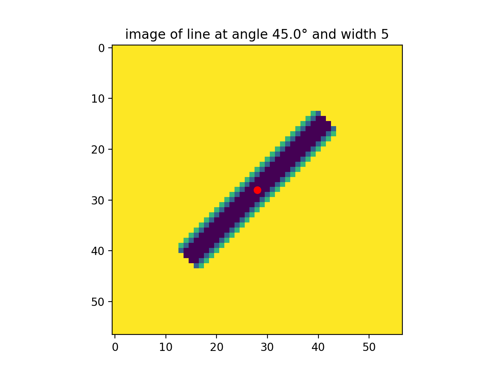|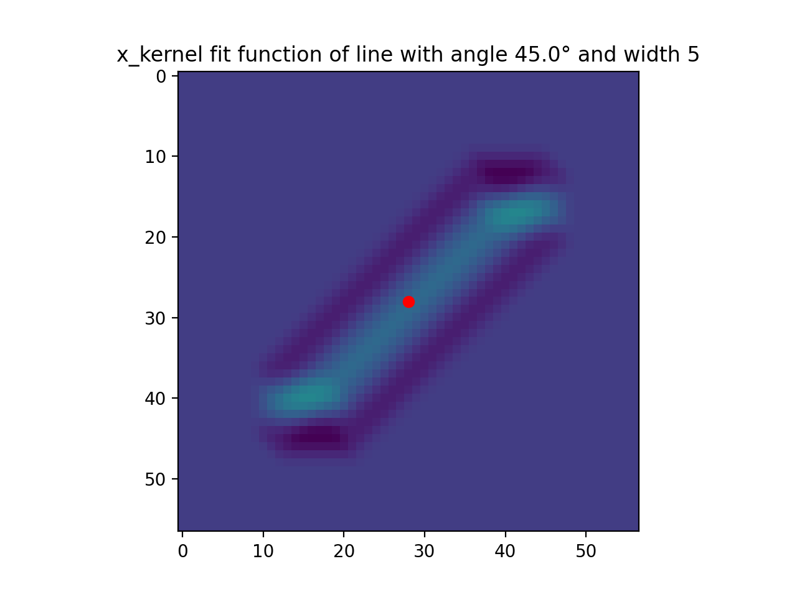||
|||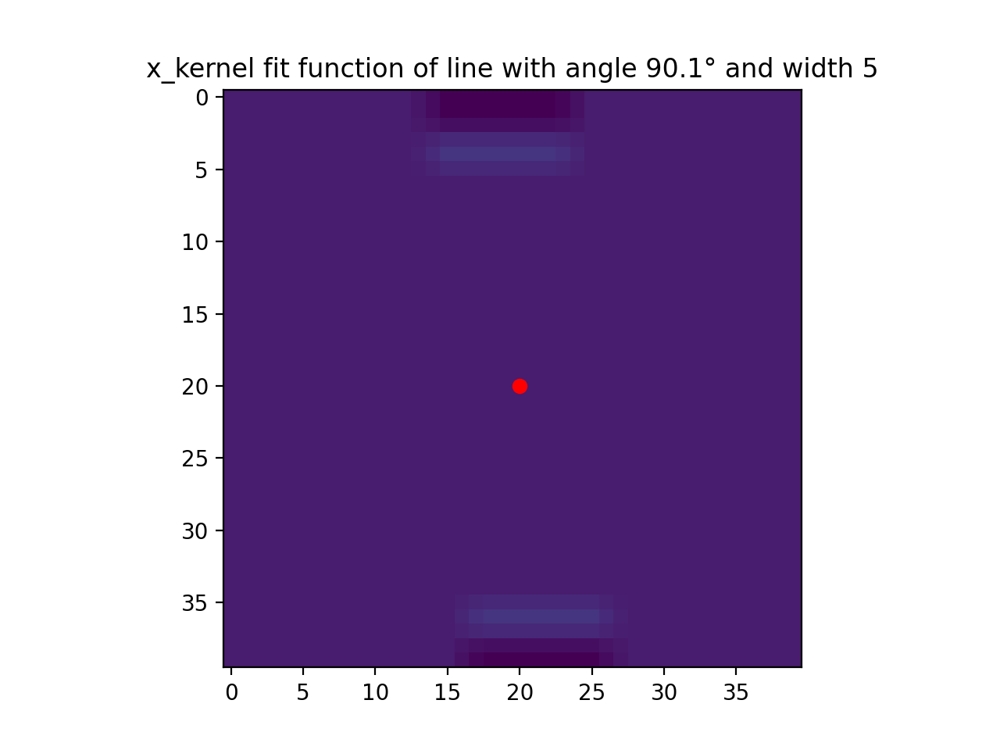|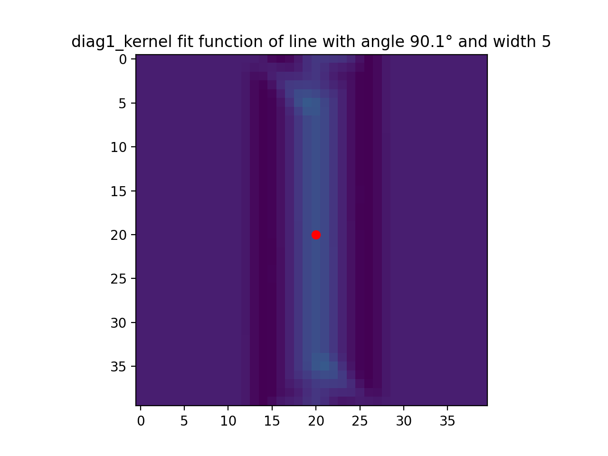|
||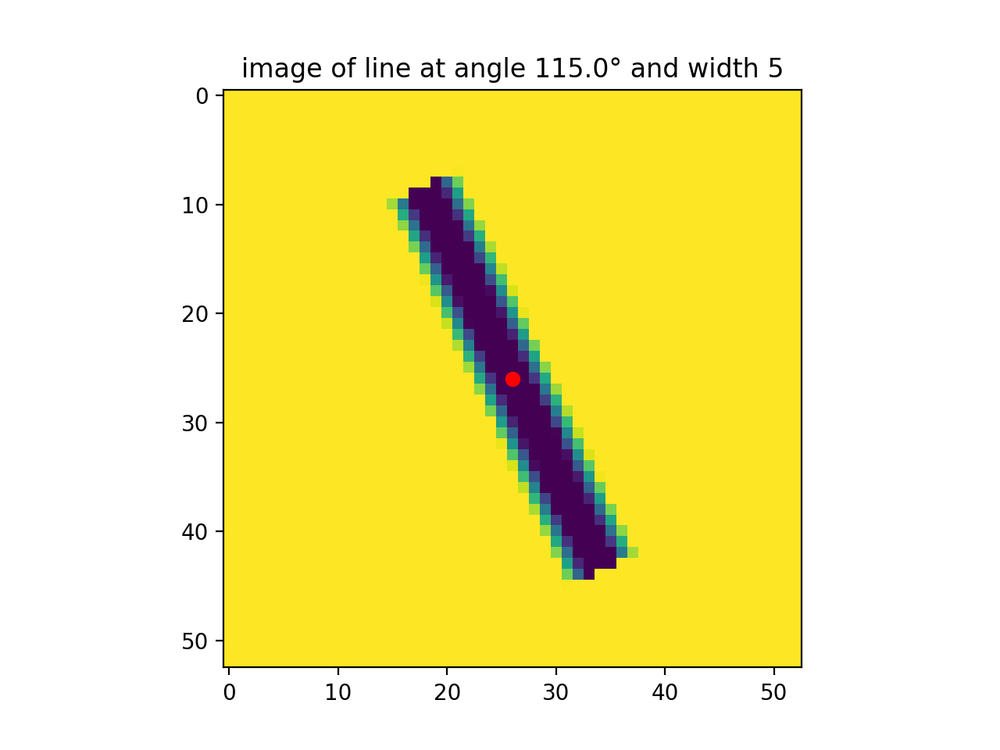||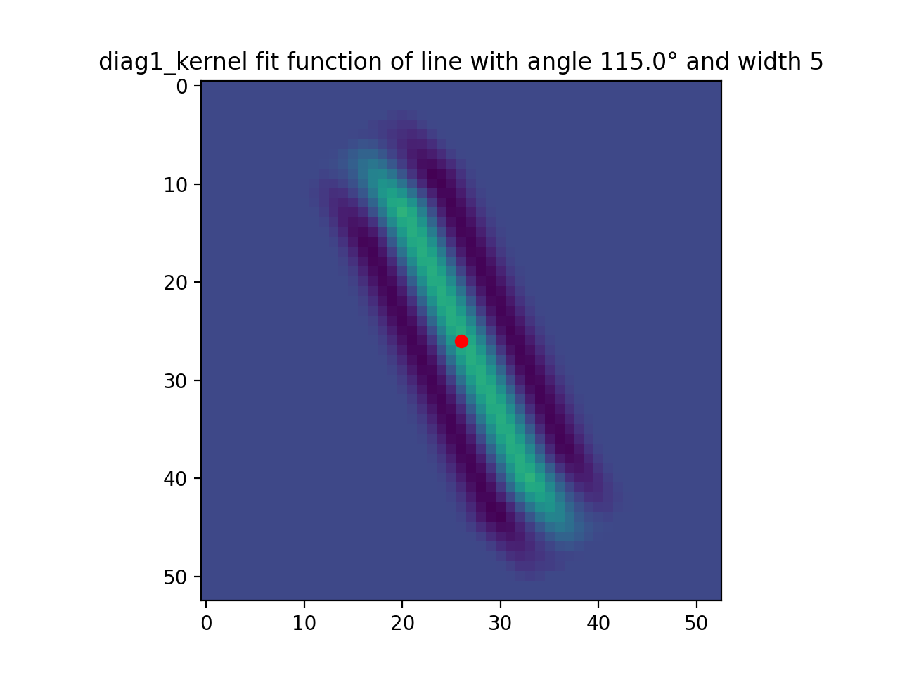|
||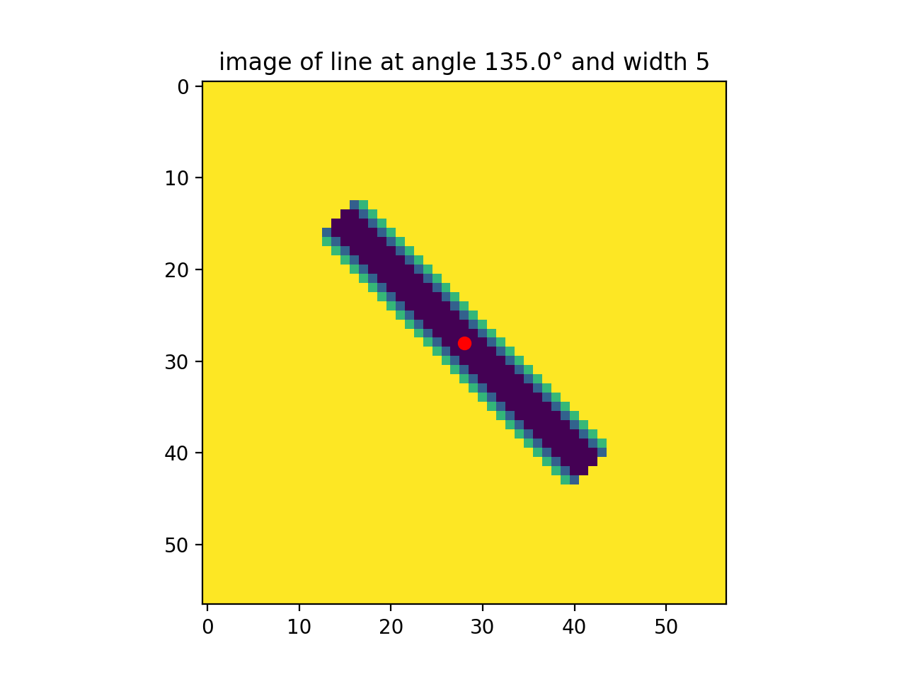|||
|||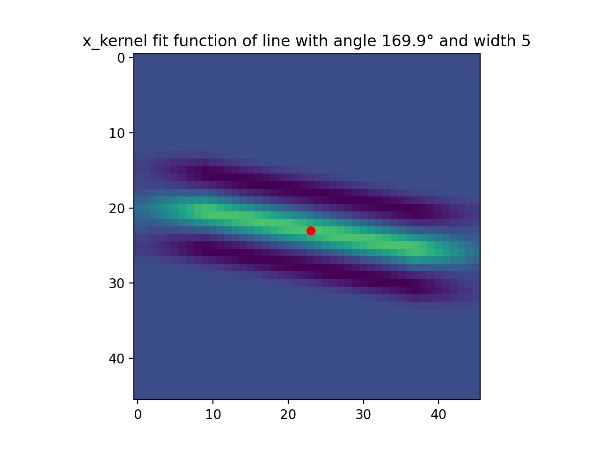|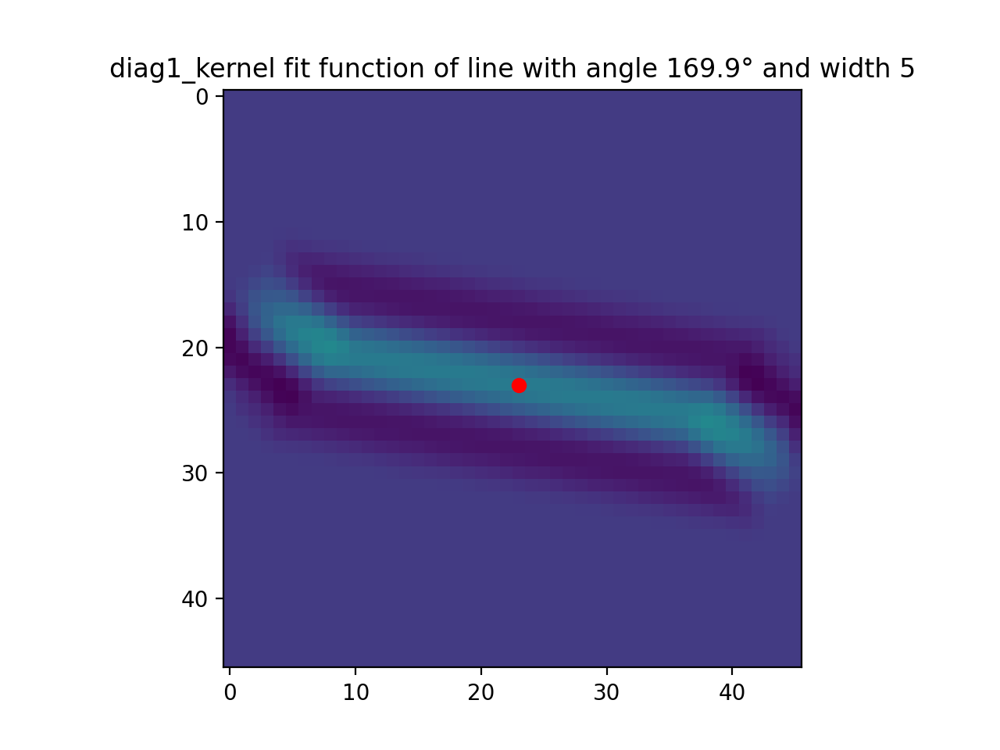|

\* the point who's value was taken for the graph is marked with a red circle

for a set of 1000 angles in the range 0 to 180 I calculated the fit function of every one of the 4 fit kernels (x,diag1,y,diag2), extracted the value at the center, (the red point in the figures) and plotted the following figure of fit value vs angle for each kernel:


so, given the 4 values of the kernels fit values - the y axis (we will call this the V-space), we want to estimate the angle - the x axis. for example the four fit values (0.66,0.17,0,0.17) correspond to the angle 0. the word estimate is important here, because not every combination of 4 values in the V-space corresponds exactly to an angle. the simplest example is (0.5,0.5,0.5,0.5) which has no corresponding angle, at all, while the tuple (0.66,0.17,0.05,0.2) could be estimated to be (0.66,0.17,0,0.17) and thus could be estimated to correspond to the angle 0. the specifics of this estimation method is what is left to be found out.

here is a comparison of the differant function forms:

it is apparent that the diagonal kernels have a sensitivity function that is slightly different. this is not surprising, since the kernels are slightly different (the 45° rotation changes the kernel).

it might be useful that $y\_ker\_val = F(x\_ker\_val)$ with the exception of the places where x_ker_val is at a platou. this is true for diag1,diag2 too. and F is also it's own inverse $F(F(x)) = x \Rightarrow F^{-1}=F$. here are some figures

|||
|---|---|
|||

#### solution - v4.1

if we model the fit values as having some true value + some random uncertainty distribution than we can use the following formalism:
let pvx(x) be some distribution corresponding to the probability of x_ker_fit_value being equal to some value x. now pvx yields some probability distribution for the line angle p_alpha, via some matrix - which we shall denote Mx. once I have the 4 angle distributions that correspond to the 4 fit kernels, I can combine them to get one distribution, and with this one distribution I can calculate the most likely angle and it's 95% uncertainty interval.
in order to calculate $M_x$, I want to try to calculate $M_x^{-1}$, this should be easier to calculate. I calculate $M_x^{-1}$ by sampling the y values and interpolating them into a grid.

##### toy example:  

say I had the following toy model function:


than $M_x^{-1}$ would be equal to:  

$$
M_x^{-1} =
\begin{pmatrix}
0 & 0 & 0 & 0 & 0 & 0 & 0 & 1\\
0 & 0 & 0 & 0 & 0 & 0 & 1 & 0\\
0 & 0 & 0 & 0 & 0 & 1 & 0 & 0\\
0 & 0 & 0 & 0 & 1 & 0 & 0 & 0\\
0 & 0 & 0 & 1 & 0 & 0 & 0 & 0\\
1 & 1 & 1 & 0 & 0 & 0 & 0 & 0
\end{pmatrix}
$$

$$
M_x =
\begin{pmatrix}
0 & 0 & 0 & 0 & 0 & \frac{1}{3}\\
0 & 0 & 0 & 0 & 0 & \frac{1}{3}\\
0 & 0 & 0 & 0 & 0 & \frac{1}{3}\\
0 & 0 & 0 & 0 & 1 & 0\\
0 & 0 & 0 & 1 & 0 & 0\\
0 & 0 & 1 & 0 & 0 & 0\\
0 & 1 & 0 & 0 & 0 & 0\\
1 & 0 & 0 & 0 & 0 & 0
\end{pmatrix}
$$

##### real problem

###### parameterize x,y angle-sensitivity-function

in order to work with the real problem, let us first find a parameter defined equivalent for this angle-sensitivity-function. in the following figure are 2 parametrisation of the y kernel's angle-sensitivity-function:
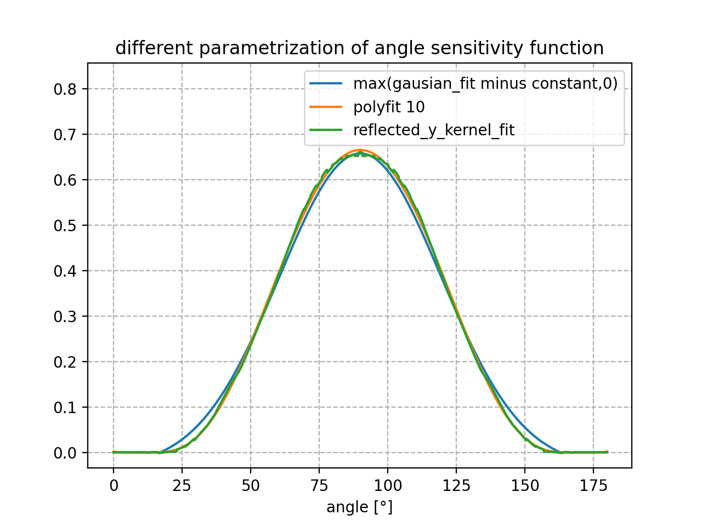
\*we are trying to paramaterize "reflected_y_kernel_fit" wich is a less noisy version of the angle-sensitivity-function. it was created by setting the left side of angle-sensitivity-function to the reflecting of it's right side.
  
the mean of the gaussian fit is 90°, the standard deviation is 29.5°, and the normalization factor is 0.69. also the constent 0.0325 was tacken from the gaussian fit, and it was set to equal 0 when it is negative.

```python
np.maximum(np.exp(-(angles-90)**2/(2*29.5**2))*0.69 - 0.0325,0)
```

the polyfit was taken around angel = 90°, and the polynomial coefficients for the 10 degree poly-fit are:

```
[0.665134361, 0, -0.000357457392, 0, 6.16006663e-08, 0, -1.99699176e-12, 0, -4.17924684e-16, 0, 3.01356888e-20]
```

where 0.665134361 is the coeff for $(angel - 90°)^0$  
and 3.01356888e-20 is the coeff for $(angel - 90°)^{10}$

as you can see the poly-10 fit unsurprisingly segnificantly better. this is not a fair match since the poly-10 fit has 6 parameters while the gaussian fit has only three.

###### parameterize d1,d2 kernel's angle-sensitivity-function


the gaussian parametrization for the diagonal's kernel is vary good. no need for polyfit.

the mean of the gaussian should be at 45°, the standard deviation is 28°, and the normalization factor is 0.681. also the constent 0.021 was tacken from the gaussian fit, and it was set to equal 0 when it is negative.

```python
np.maximum(np.exp(-(z_ang)**2/(2*28**2))*0.681 - 0.021,0)
```

###### the kernel's angle-sensitivity's matrix form

instead of calculating $M_x^{-1}$ and then inverting it, I ended up calculating $M_x$ directly by the following equation:  

$$
M_{x_{not normed}}(angle,fit\_value) = \exp(-\sigma \cdot |real\_fit\_value(angle) - fit\_value|)\\
M_{x}(angle,fit\_value) = M_{x_{not normed}}(angle,fit\_value)/Sum\_On\_Column(fit\_value)\\\\
\sigma = some tune-able constant that creates widths
$$

the matrices that you get are:
  
|||||
|-|-|-|-|
||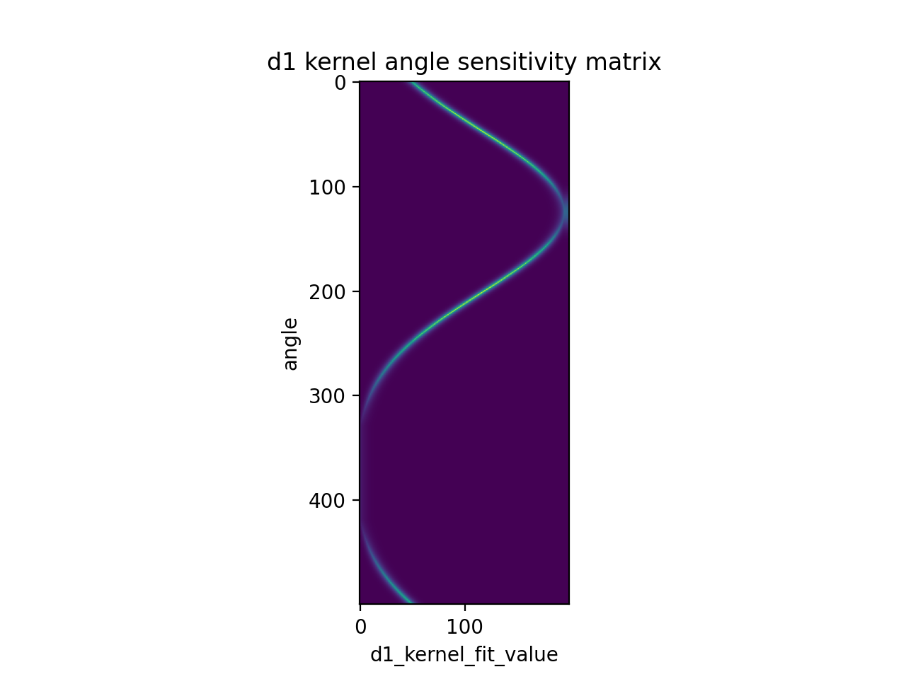||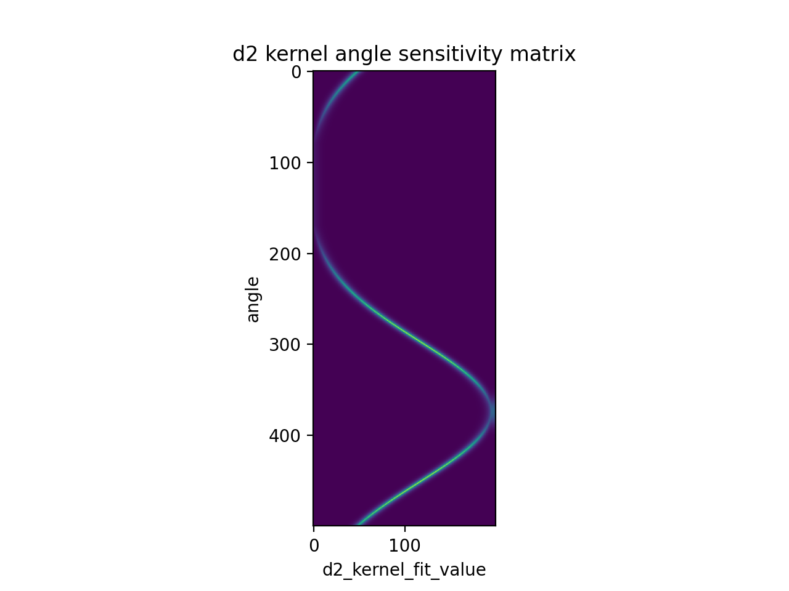|

matrices made with sigma = 100

when this is applied to measured fit values that corrispond to angle 20° we get the following graph


and when these results are multiplied and normalized to be a probability function we get:


but there is a problem with this mean calculation method.  


for lines with angles that are close to 0° or 180°, the probability function gets split because of the ciclic nature of these angles. unike regular angles, because in this problem a 0° line is equivilant to a 180° line and a 20° line is equivilant to a 200° line, these angles are defined up t a modulu of 180 (half a rotation). and this is not taken into acount in calculating the mean angle. as can be seen in the following figure, the average of a probability distrebution centered equally around 0°, and 180° is 90° which **couldn't be more wrong!**.


the solution as posed in Wikipedia to solve this for angles that are defined modulus 360° is to place the distribution on a circle at the 2d plane, calculate the 2d point average,then calculate the angle of said average, and you'r done. this is implemented done by calculating the average of the complex exponents of the numbers, $\sum{P(alpha)e^{i\alpha}}$ where alpha is in radians. and taking the arg of the complex result

because in this problem the angles are defined modulus 180°, we need to multiply them by 2 before applying the solution above, and divide the result by 2.

after applying this method (and days of searching for bugs)

|||
|:-:|:-:|
|||
|||
